# TileLang-Ascend Programming Guide

## 1. TileLang介绍

TileLang是一种面向tile（数据块）级别编程的DSL（领域特定语言），基于其数据块层级的抽象，使开发者能够以一种高级、可组合的方式表达和优化底层内核行为。TileLang可以让开发者显式控制内存分配、数据移动、布局和并行执行。

下图展示了TileLang程序如何从高级描述逐步降低为面向特定硬件的可执行程序。我们提供了三种不同的编程接口，分别面向初学者、开发者和专家用户，这些接口分别位于这一降低流程的不同层级。TileLang还允许在同一内核中混合使用这些接口，使用户能够根据自身需求选择最适合的抽象层次进行编程。

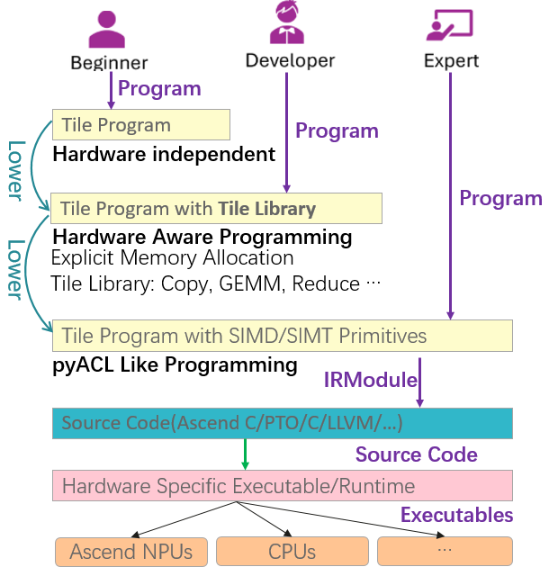

- **Beginner Level (Hardware-Unaware)**

  这种模式主要适用于需要编写不依赖于特定硬件细节代码的用户，目标是让开发者能够专注于基本逻辑，而不必担心内存层次结构或硬件特定的优化。

  > 当前还不支持该编程模式。

- **Developer Level (Hardware-Aware with Tile Library)**

  专为对AI芯片内存层次结构和性能考量有基本了解的开发人员设计，提供了一个Tile库，其中包含针对各种硬件架构优化的预定义操作和模式。这一级别的用户可以利用这些现成的原语，而无需深入研究底层的线程细节。

- **Expert Level (Hardware-Aware with Thread Primitives)**

  对于那些对底层硬件特性（例如Ascend的Cube、Vector、MTE、Unified Buffer等）有深入理解的高经验用户而言，提供了更底层的硬件控制，如细粒度同步、更低级别的操作接口和寄存器相关的设置等，从而能够对性能关键的内核代码进行细粒度的控制。这一层级为针对特定架构的专门优化提供了最大的灵活性。

## 2. TileLang开发快速入门

### 2.1 TileLang开发环境

第一步，**CANN环境准备**：

我们假设您已搭建好包含CANN（至少8.3.RC1版本）和torch-npu（至少2.6.0.RC1版本）的昇腾环境，首先设置CANN环境变量。

```
source {your-cann-installed-path}/ascend-toolkit/set_env.sh
```

第二步是**安装TileLang-Ascend**，我们这里采用源码安装的方式：

```
a) 下载
git clone --recursive https://github.com/tile-ai/tilelang-ascend.git
cd tilelang-ascend

b) 编译安装
bash install_ascend.sh

c) 设置环境变量
source set_env.sh
```

然后，就可以**运行**examples下面的例子：

```
cd examples/gemm
python example_gemm.py

成功后会打印：
Kernel Output Match!
```

### 2.2 TileLang 算子kernel示例

下面是一个TileLang开发的kernel函数示例，实现两个张量做逐元素和（Elementwise Add）：

```python
import tilelang
import tilelang.language as T
from tilelang import jit

import torch

pass_configs = {
    tilelang.PassConfigKey.TL_ASCEND_AUTO_SYNC: True,
    tilelang.PassConfigKey.TL_ASCEND_MEMORY_PLANNING: True,
}

M = 1024
N = 1024
block_M = 128
block_N = 128

VEC_NUM = 2

@jit(out_idx=[-1], pass_configs=pass_configs)
def tile_add(M: int, N: int, block_M: int, block_N: int, dtype: str = 'float'):
    m_num = M // block_M
    n_num = N // block_N

    @T.prim_func
    def add_kernel(
        A: T.Tensor((M, N), dtype),
        B: T.Tensor((M, N), dtype),
        C: T.Tensor((M, N), dtype),
    ):
        with T.Kernel(m_num * n_num, is_npu=True) as (cid, vid):
            bx = cid // n_num
            by = cid % n_num

            a_ub = T.alloc_shared((block_M // VEC_NUM, block_N), dtype)
            b_ub = T.alloc_shared((block_M // VEC_NUM, block_N), dtype)
            c_ub = T.alloc_shared((block_M // VEC_NUM, block_N), dtype)
            
            T.copy(A[bx * block_M + vid * block_M // VEC_NUM, by * block_N], a_ub)
            T.copy(B[bx * block_M + vid * block_M // VEC_NUM, by * block_N], b_ub)

            for i, j in T.Parallel(block_M // VEC_NUM, block_N):
                c_ub[i, j] = a_ub[i, j] + b_ub[i, j]

            T.copy(c_ub, C[bx * block_M + vid * block_M // VEC_NUM, by * block_N])

    return add_kernel

func = tile_add(M, N, block_M, block_N)

torch.manual_seed(0)

a = torch.randn(M, N).npu()
b = torch.randn(M, N).npu()

torch.npu.synchronize()
print("init successful!")

c = func(a, b)

ref_c = a + b

torch.testing.assert_close(c, ref_c, rtol=1e-2, atol=1e-2)
print("Kernel Output Match!")

```

下面来看一下上面示例代码中的关键语法组成。

首先是导入相关的库，然后就可以调用TileLang提供的功能：

```python
import tilelang
import tilelang.language as T
from tilelang import jit
```

接下来是算子kernel函数的定义和实现，TileLang算子kernel函数由`@T.prim_func` 装饰器在模块内定义（`add_kernel`），这部分会被TileLang调用编译工具链编译成可以在NPU上运行的二进制代码。Python函数`tile_add`包装了kernel函数，通过`return add_kernel`语句返回装饰过的`add_kernel`，供后续调用。

```python
func = tile_add(M, N, block_M, block_N)
c= func(a, b)
```

然后，我们来看下kernel内部的部分。

`T.Tensor`将kernel的参数（`A`、`B`、`C`）声明为张量数据类型，其中通过`@jit`装饰器的参数out_idx=[-1]来指定最后一个参数、也即`C`为输出参数，其余参数为输入参数（关于`@jit`后续会详细说明，可以理解为调用被其装饰的函数时会触发即时编译）。

`T.Kernel`原语定义了一个kernel运行的上下文。在其中，通过调用TileLang提供的各种内存分配（`T.alloc_shared`）、数据搬运（`T.copy`）、计算原语（如上述被`T.Parallel`包围的计算逻辑）实现算子逻辑。

VEC_NUM用来指定vector计算单元的数量。由于在Ascend架构中，每个AI Core中有两个Vector计算单元，所以针对每个切分后的Tile，还可以进一步切分为两个sub tile，充分利用vector计算资源。


还有一部分是数据切分逻辑。待计算数据是`(M, N)`大小的数据，由于片上存储空间的限制，需要进行切分成多个能够容纳的Tile块，并且通过并行计算。例如，上面的代码中，`(block_M, block_N)`就是切分的Tile的大小，可以图示如下：

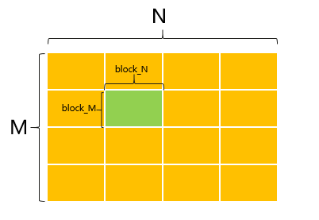

这个切分的Tile的数量为`m_num * n_num`，上述的`T.kernel`可以理解为为切分后的每个Tile创建一个并发执行单元，kernel里定义的操作在每个Tile上执行搬运、计算，多个并发执行单元并发运行，互不影响。`with T.kernel`返回的元组`(cid, vid)`中，`cid`可以理解为计算任务的数量（每个Tile对应一个计算任务，对应一个逻辑核来处理），`vid`值为0、1，即每个Tile再由两个子计算单元来完成。


示例代码中的其余部分是通过调用torch来实现参考值，然后和算子计算输出的实际值进行比对，以验证算子逻辑的正确性。

### 2.3 TileLang编译和运行

TileLang Ascend的工作流程，主要分为编译和运行两个阶段：

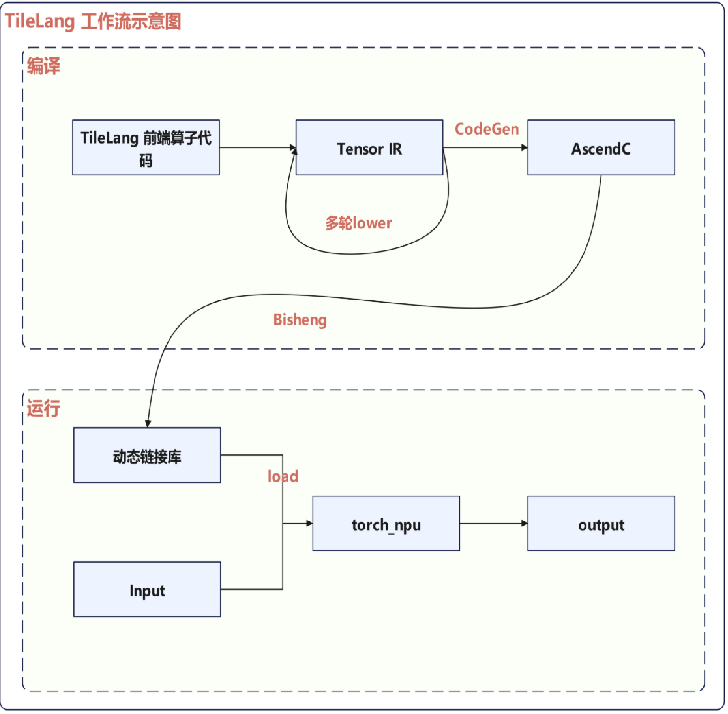

- 编译阶段
  1. 多轮lower转换：TileLang算子代码根据NPU硬件特性进行多级降级，生成针对昇腾硬件优化的TensorIR表示
  2. AscendC代码生成：基于TensorIR，使用专门的Ascend Codegen模块生成对应的AscendC代码
  3. 动态库编译：通过毕昇编译器（bisheng）将AscendC代码编译成动态链接库（.so文件）
- 运行阶段
  1. 库文件加载：通过ctypes将.so文件加载到Python环境中
  2. 函数封装：将算子封装为可调用的Python函数对象
  3. 执行调用：用户以普通Python函数方式调用，提供输入张量即可在昇腾NPU上执行计算并获得结果


TileLang还支持JIT（Just-in-time，即时编译）。JIT是一种动态编译技术，Tilelang算子开发过程中通过JIT调用CodeGen生成AscendC代码，并对整个过程进行动态调控，解决静态编译的局限性，确保生成的AscendC代码动态适配NPU特性，同时最大化提升算子执行效率。

- 动态参数驱动的AscendC定制代码生成。JIT会在运行中实时解析输入参数，同步向CodeGen传递参数维度、数据类型等信息，确保NPU算子支持动态输入。
- NPU硬件约束下的AscendC语法修正。JIT在运行时可检测当前NPU硬件的资源配置，严格遵守硬件资源限制，指导CodeGen生成符合性能约束的AscendC代码。
- 算子运行时的即时编译与动态优化。算子运行过程中，JIT会在编译过程中结合NPU当前的硬件状态优化指令分配，根据AI Core的利用率和内存占用情况动态调整编译策略。

在TileLang kernel开发中，通过 **@jit** 装饰器来触发调用时的即时编译。

## 3. TileLang语法基础

本节介绍TileLang（tile-lang）领域特定语言（DSL）的核心语法基础，你将使用这种语言编写高性能的内核。重点介绍如何定义内核、表达迭代操作、在内存域之间移动数据，以及如何通过即时编译（JIT）运行内核。

### 3.1 kernel定义

TileLang kernel是基于TIR（TVM IR）生成的函数，用`@T.prim_func`来修饰。参数类型为`T.Tensor`或`T.Buffer`，包含了shape和dtype信息。

```
@T.prim_func
def add_kernel(
    A: T.Tensor((N,), dtype),    # dtype could be 'float32'
    B: T.Tensor((N,), dtype),
    C: T.Tensor((N,), dtype),
):
    ...  # kernel body
```

shape除了可以是整形常量外，还可以是符号变量的形式表示，以支持动态信息传递。在TileLang中，支持两种符号变量的形式：

- **T.dyn[...]**

  这种方式对于符号变量的使用，在kernel体内通过buffer的shape信息来获取和使用。

  ```
  # 1) Annotation-only symbol; read the bound size via shape
  K = T.dyn['K']  # dtype defaults to int32
  @T.prim_func
  def foo(A: T.Tensor((K,), 'float32')):
      N = A.shape[0]
      for i in T.serial(N):
          ...
  ```

  

- **T.dynamic(name, dtype)**

   这种方式创建一个tir.Var，然后可以直接在后续的表达式和循环语句中使用该符号。

  ```
  # 2) Explicit Var symbol usable in the body
  K = T.dynamic('K', 'int32')   # or T.dynamic('K') defaults to int32
  @T.prim_func
  def bar(A: T.Tensor((K,), 'float32')):
      for i in T.serial(K):
          ...
  ```

注意：

- T.symbolic(name, dtype) 是T.dynamic的一个已弃用的别名；建议使用T.dynamic。
- 在 `@jit`中, 具体的尺寸来自第一次调用时传入的实际张量参数.
- 注解中的符号不需要作为单独的kernel参数；TileLang 会从参数形状中绑定它们。

### 3.2 数据类型

dtype用于指定Tile的数据类型，支持的类型列表有：

```
float16, float32, bfloat16, int8, int16, int32, int64, uint8, uint16, uint32, uint64
```


### 3.3 kernel launch

**with T.Kernel(...)** 声明一个kernel运行上下文，并且创建数据tile block与逻辑核的绑定关系。对于Ascend NPU来说，对于每个block，返回一个（cid，vid)的元组。cid的范围为 [0,block_num), vid的范围为0或1。因为A2/A3的CV核配比可以为1:2或1:1, 可以通过vid指定当前vector的索引。

下面的代码片段对于(M, N)大小的数据块，切分为（block_M，block_N）大小的基本tile block，tile block的数量为m_num * n_num个，代码逻辑可以理解为多个并发的执行单元，每个单元处理一个tile block（针对每个tile block，又可以根据vector数量切分为1个或2个vector单元并发处理）。

```
m_num = M // block_M
n_num = N // block_N
VEC_NUM = 2

@T.prim_func
def main(A: T.Tensor((M, N), dtype),
         B: T.Tensor((M, N), dtype),
         C: T.Tensor((M, N), dtype)):
    with T.Kernel(m_num * n_num, is_npu=True) as (cid, vid):
        ......
```


### 3.4 Loops和Control Flow

TileLang kernel支持标准Python语法中的if/elif/else条件语句。条件应该是TIR expression（例如：i < N），Python中的普通布尔值被视为编译时常量，并且会被折叠（即优化掉）。

```
for i in T.serial(N):
    if i < N:            # TIR condition
        C[i] = A[i] + B[i]
    else:
        pass

# Ternary
x = (A[i] if i < N else 0)
```


TileLang支持多种循环表达形式。

- **Serial**

**T.serial**构造普通的for循环。

```
for i in T.serial(N):
    ...                     # 0..N-1

for i in T.serial(0, N, 2):
    ...                     # 0, 2, 4, ...
```

- **Unroll**

**T.unroll**针对小循环次数进行循环展开。

```
for k in T.unroll(K_TILE):
    acc += a[k] * b[k]
```

这是一种高级使用模式，TileLang 将展开提示传递给 TIR；专家用户可通过因子化或显式调节参数进行优化调优。

- **Parallel**（element-wise）

**T.Parallel**(ext0, ext1, ...)构建嵌套循环，这些循环能够很好地将Tile运算映射到逐元素操作。循环体通过一个for头接收所有索引：

- **运算操作**：
```python
# 一维运算场景
for i in T.Parallel(v_block):
    m_i[i] = T.max(m_i[i], m_i_prev[i])
```
```python
# 二维运算场景
for (i, j) in T.Parallel(v_block, d):
	acc_o_ub[i, j] /= T.exp(attn_sink_ub[i] - scores_max[i])
```
- **拷贝操作**：

``` python
# GM -> UB 拷贝&计算场景
for i, j in T.Parallel(block_M // VEC_NUM, block_N):
	C[bx * block_M + vid * block_M // VEC_NUM + i, by * block_N + j] = T.exp(a_ub[i, j])
```

Developer模式调度原语章节会有详细介绍。

- **Pipelined**

**T.Pipelined**(iters, num_stages=...)可以进行计算/搬运的流水掩盖。

```
for ko in T.Pipelined(T.ceildiv(K, BK), num_stages=3):
    T.copy(A[by * BM, ko * BK], A_s)   # stage: copy A tile
    T.copy(B[ko * BK, bx * BN], B_s)   # stage: copy B tile
    T.gemm_v0(A_s, B_s, C_f)           # stage: compute
```
三段式流水并行排布示意：
```
------------------------------------->
  stage1  |     stage2     |  stage3 
--------------------------------------
copy copy | copy copy copy | ---- ----
---- ---- | gemm gemm gemm | gemm gemm
--------------------------------------
```

Developer模式调度原语章节会有详细介绍。

- **Persistent**

**T.Persistent**(domain, wave_size, index, group_size=...)可以让数据在多个AI Core间负载更均衡，并且提高数据缓存的命中概率。

```
for bx, by in T.Persistent([T.ceildiv(M, block_M), T.ceildiv(N, block_N)],
                    core_num, cid):
    ...
```

- **While loop**

TileLang支持while循环表达，循环条件需要是TIR expression。如果TileLang检测出死循环会编译报错。

```
i = 0
while i < N:
    ...
    if done:
        break
    i += 1
```


**Break和Continue**

在T.serial/T.unroll/T.Parallel/while循环中，可以使用break/continue来退出整个循环或本次循环。

## 4. TileLang编程模式和原语

### 4.1 Developer模式

Developer编程模式主要是基于TileLang定义的Tile Library接口以及原语来编写TileLang kernel，开发者基于这种开发方式会更容易，而且代码层面理论上也可以做到跨架构平台的兼容。当然，基于Develoer模式，也可以调用Expert模式的扩展接口，这通常是为了性能考虑。

#### 4.1.1 内存分配原语

TileLang中可以显示指定存储的分配层级，并且对存储层级进行了抽象，分为Global、shared和fragment级别，这里的内存分配主要关注片上存储。

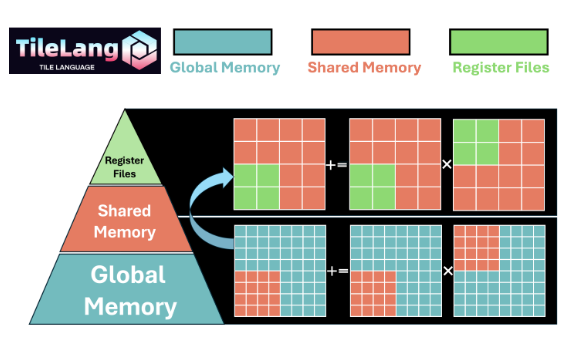

其中，shared层级对应的存储位于片上的高速存储，该层级的存储常用于缓存计算过程中的临时中间数据，因为它的访问速度要远高于Global Memory（HBM）。例如，在矩阵计算时，经过切分的tile粒度的小数据块可以被首先加载到shared层级的内存，后续的操作都直接访问shared内存，从而减少频繁的从Global Memory加载和存储带来的性能开销。

fragment层级的存储对应偏上的寄存器级别的存储单元，一般用于某一个计算单元（例如Cube）的输入和输出，该层级的存储容量一般较小，但访问速度要最快，要高于shared层级的存储。例如，在矩阵计算时，左矩阵和右矩阵分别被加载到对应的fragment层级的存储，计算后的结果也存储到fragment层级的存储，从而实现高效的矩阵计算。

两个层级的存储分配定义如下。

- `T.alloc_shared(shape, dtype)`: 

  **参数**：

  - Parameters:

    **shape** (*tuple*) – The shape of the buffer to allocate 

    **dtype** (*str*) – The data type of the buffer (e.g., ‘float32’, ‘int32’)

  **功能说明**：分配shared类型的存储空间。

  **举例**：

  ```
  A_L1 = T.alloc_shared((block_M, block_K), dtype)
  ```

- `T.alloc_fragment(shape, dtype, scope='local.fragment')`: 

  **参数**：

  - Parameters:

    **shape** (*tuple*) – The shape of the buffer to allocate

    **dtype** (*str*) – The data type of the buffer (e.g., ‘float32’, ‘int32’)

  **功能说明**：分配fragment类型的存储空间。

  **举例**：

  ```
  C_L0 = T.alloc_fragment((block_M, block_N), accum_dtype)
  ```

- `T.alloc_var(dtype, init, scope='local.var')`:

  **参数**：

  - **dtype** (*str*) – 变量的数据类型（例如：'float32', 'int32', 'bool'）

  - **init** (*可选*) – 初始值，可以是常量值、表达式或其他变量

  - **scope** (*str, 可选*) – 内存作用域，默认为 "local.var"

  **功能说明**：

  分配变量用于存储标量数据。适用于条件判断的标志位、循环计数器、临时标量变量等场景。支持灵活的初始化方式，可以指定初始值或从其他变量初始化。

  **举例**：

  基础用法：
  ```
  # 分配布尔类型标志位，初始化为False
  flag = T.alloc_var("bool", init=False)
  
  # 分配整数变量，初始化为1
  counter = T.alloc_var("int32", init=1)
  
  # 分配浮点数变量，初始化为0.0
  value = T.alloc_var("float32", init=0.0)
  ```

  变量间初始化：
  ```
  # 用另一个变量的值初始化
  a = T.alloc_var("int32", init=1)
  b = T.alloc_var("int32", init=a)  # b的初始值为a的值
  ```

  在条件逻辑中使用：
  ```
  flag = T.alloc_var("bool", init=False)
  a = T.alloc_var("int32", init=1)
  
  flag = True
  if flag:
      a = 2
  else:
      a = a + 1
  ```

  指定内存作用域：
  ```
  # 使用默认作用域
  var1 = T.alloc_var("int32", init=1)
  
  # 显式指定作用域
  var2 = T.alloc_var("int32", "local.var", init=1)
  var3 = T.alloc_var("int32", init=1, scope="local.var")
  ```

  **注意**：

  - 初始化值会直接写入变量，而不是默认的零值
  - 支持的初始化值类型包括常量、表达式和其他变量
  
在Ascend平台中，shared层级的存储对应到L1 Buffer 和 Unified Buffer，前者用于Cube计算，后者对应到Vector计算。但用户无需关心指定的存储是L1 Buffer还是Unified Buffer，TileLang的编译器会通过程序上下文自动分析和识别。fragment层级的存储对应到L0A/L0B/L0C Buffer，同样，用户无需显示指定是分配的是哪种，TileLang编译器会根据程序上下文自动分析和识别。

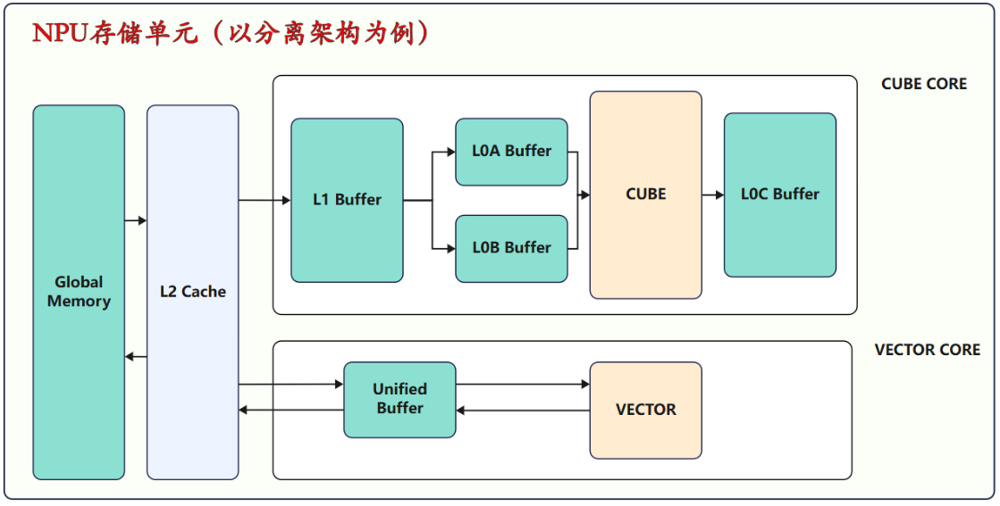

#### 4.1.2 数据搬运原语

数据搬运操作可以实现tile数据块在不同的内存层级之间拷贝，支持tir.Buffer、BufferLoad、BufferRegion类型的数据。

- `T.copy(src, dst)`:

  **参数**：

  Move tiles between Global/Shared/Fragment.

  - Parameters:

    **src**：源数据buffer

    **dst**：目的数据buffer

  **功能说明**：将数据从src搬运到dst所在的存储空间。

  **举例**：

  ```
  T.copy(A[bx * block_M, k * block_K], A_L1)
  ```

支持的数据搬运类型有下标所示。

| src  | dst  | 说明                                              |
| ---- | ---- | :------------------------------------------------ |
| GM   | L1   | 数据从Global Memory搬运到L1 Buffer                |
| L1   | L0A  | 数据从L1 Buffer搬运到L0A Buffer，Cube计算的左矩阵 |
| L1   | L0B  | 数据从L1 Buffer搬运到L0B Buffer，Cube计算的右矩阵 |
| L0C  | GM   | 数据从L0C Buffer搬运到Global Memory               |
| GM   | UB   | 数据从Global Memory搬运到Unified Buffer           |
| UB   | GM   | 数据从Unified Buffer搬运到Global Memory           |
| UB   | UB   | 数据从Unified Buffer搬运到Unified Buffer          |
| UB   | L1   | 数据从Unified Buffer搬运到L1 Buffer               |

`T.tile.atomic_add(dst_gm, src_local)` 是 Ascend 专属的原子累加写回原语。它不是普通 `T.copy`，而是在 local tensor 到 GM 的写回过程中执行原子累加，适合多个 block/core 将 partial result 累加到同一 GM 输出的场景。若业务语义是从 0 开始累加，调用前或 kernel 内需要先清零 GM 输出。

#### 4.1.3 计算原语

##### 4.1.3.1 矩阵计算

- `T.gemm_v0(A, B, C, transpose_A=False, transpose_B=False, init=False):`

  **参数**：

  - Parameters:

    A：左输入矩阵

    B：右输入矩阵

    C：结果累加存储输出矩阵

    transpose_A：是否要对A输入矩阵进行转置

    transpose_B：是否要对B输入矩阵进行转置

    init：在计算前下对累加矩阵C进行清零，一般情况下由于需要对矩阵进行切片，第一次计算需要对累加矩阵清零，后续在基础上累加。

  **功能说明**：gemm操作用来实现两个tile的矩阵乘操作，特别的是它的左矩阵（A_shared）和右矩阵（B_shared）都是位于shared存储层级，输出（C_fragment）位于fragment存储层级，A_shared和B_shared的进行矩阵乘操作，然后结果和C_fragment已有值进行累加并赋值到C_fragment。

  ```
  C_fragment += A_shared * B_shared
  ```

  **举例**：

  ```
  for k in T.serial(loop_k):
      ......
      T.gemm_v0(A_L1, B_L1, C_L0, init=(k == 0))
      ......
  ```
  

##### 4.1.3.2 Reduce类

当前 Ascend reduce 仍然属于 fast-path 原语，主要服务于 UB tile / slice buffer 场景。本次接口语义与实现边界如下：

- 当前支持 1D buffer、2D buffer，以及 3D trailing-tile buffer；当前主要验收范围是 2D UB/slice reduce。
- `dim` 支持范围：
  - 1D buffer：`0` / `-1`
  - 2D buffer：`0` / `1` / `-1` / `-2`
  - 3D buffer：仅支持 trailing-tile 轴 `0` / `1` / `-1` / `-2`
- `clear=True` 表示先初始化输出再写入 reduce 结果；`clear=False` 表示在已有 `out` 上做 merge：
  - `reduce_sum`：将 reduce 结果与已有 `out` 相加
  - `reduce_max`：将 reduce 结果与已有 `out` 逐元素取最大值
  - `reduce_min`：将 reduce 结果与已有 `out` 逐元素取最小值
- `real_shape` 用于描述 2D slice buffer 的逻辑有效区域；未设置时默认使用物理 buffer 形状。
- `out` 一般可以使用两类 shape：
  - 压缩后的 reduce 结果 shape。例如输入为 `[M, N]` 时，`dim=-1` 可输出为 `[M]`，`dim=0` 可输出为 `[N]`。
  - keepdim 形式的 shape，即保留被规约的轴，但该轴长度变为 `1`。例如输入为 `[M, N]` 时，`dim=-1` 可输出为 `[M, 1]`，`dim=0` 可输出为 `[1, N]`。
- `keepdim` 不表示输出 shape 可以任意保持为与输入 buffer 相同的 shape；只有在被规约轴本身长度就是 `1` 的退化情况下，数值上才可能与输入 shape 一致。
- 对 2D slice buffer 且设置了 `real_shape` 的兼容路径，`out` 还允许保持部分 physical-layout 形式，例如 `[physical_cols]` 或 `[1, physical_cols]`；这是为了兼容当前后端对 slice buffer 的 lowering 方式。
- 非法 `dim`、非法 `real_shape`、非法 `out` shape 会在前端直接报错，而不是静默进入后端。
- `clear` 和 `real_shape` 同时支持关键字传参和兼容的 positional 传参形式，建议优先使用关键字形式以获得更清晰的可读性。

- `T.reduce_sum(buffer: Buffer, out: Buffer, dim: int = -1, clear: bool = True, real_shape: list[int] | None = None)`

  **参数**：

  - buffer：输入buffer
  - out：目的输出buffer
  - dim：reduce轴
  - clear：是否在计算前清空输出buffer
  - real_shape：2D slice buffer 的逻辑有效范围

  **功能说明**：

  对一个多维向量按照指定的维度进行数据累加。

  定义指定计算的维度（Reduce轴）为R轴，非指定维度（Normal轴）为A轴。如下图所示，对shape为(2, 3)的二维矩阵进行运算，指定在第一维计算数据的累加，输出结果为[5, 7, 9]；指定在第二维计算数据的累加，输出结果为[6, 15]。

  按第一个维度计算示例：

  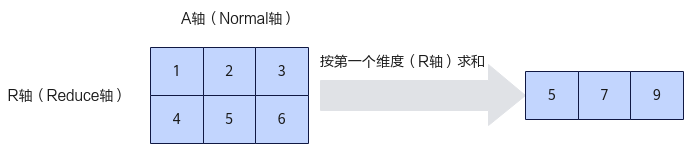

  按最后一个维度计算示例：

  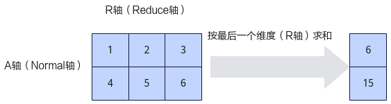

  以上图示均以 `clear=True` 为例，主要说明不同 `dim` 下的 reduce 方向、输出 shape 和 reduce 结果本身。当 `clear=False` 时，reduce 的轴语义和输出 shape 约束保持不变，只是在得到 reduce 结果后，还会再与已有 `out` 按对应规则做 merge，而不是直接覆盖写入。

  **举例**：

  ```
  T.reduce_sum(acc_s_ub, sumexp_i_ub, dim=-1)
  ```

  带 `clear=False` 的示例：

  ```
  T.reduce_sum(acc_s_ub, sumexp_i_ub, dim=-1, clear=False)
  ```

- `T.reduce_max(buffer: Buffer, out: Buffer, dim: int = -1, clear: bool = True, real_shape: list[int] | None = None)`

  **参数**：

  - buffer：输入buffer
  - out：目的输出buffer
  - dim：reduce轴
  - clear：是否在计算前清空输出buffer
  - real_shape：2D slice buffer 的逻辑有效范围

  **功能说明**：

  对一个多维向量在指定的维度求最大值。

  定义指定计算的维度（Reduce轴）为R轴，非指定维度（Normal轴）为A轴。如下图所示，对shape为(2, 3)的二维矩阵进行运算，指定在第一维求最大值，输出结果为[4, 5, 6]；指定在第二维求最大值，输出结果为[3, 6]。

  按第一个维度计算示例：

  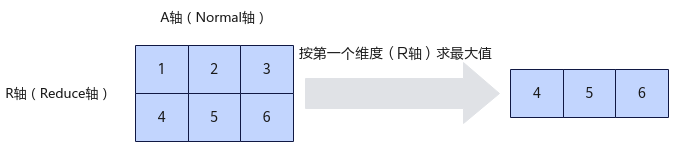

  按最后一个维度计算示例：

  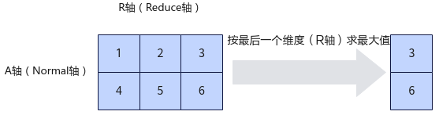

  **举例**：

  ```
  T.reduce_max(acc_s_ub, m_i, dim=-1)
  ```

  带 `real_shape` 的示例：

  ```
  T.reduce_max(in_shared, out_shared, dim=-1, real_shape=[4, 4])
  ```

- `T.reduce_min(buffer: Buffer, out: Buffer, dim: int = -1, clear: bool = True, real_shape: list[int] | None = None)`

  **参数**：

  - buffer：输入buffer
  - out：目的输出buffer
  - dim：reduce轴
  - clear：是否在计算前清空输出buffer
  - real_shape：2D slice buffer 的逻辑有效范围

  **功能说明**：

  对一个多维向量在指定的维度求最小值。

  定义指定计算的维度（Reduce轴）为R轴，非指定维度（Normal轴）为A轴。如下图所示，对shape为(2, 3)的二维矩阵进行运算，指定在第一维求最小值，输出结果为[1, 2, 3]；指定在第二维求最小值，输出结果为[1, 4]。

  按第一个维度计算示例：

  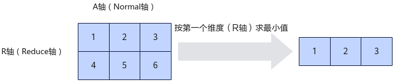

  按最后一个维度计算示例:

  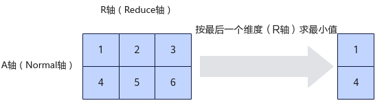

  **举例**：

  ```
  T.reduce_min(a_ub, b_ub, dim=-1)
  ```

  Slice buffer 与基础 reduce 示例可参考：

  - `examples/reduce/example_row_reduce_max_slice_buffer.py`
  - `examples/reduce/example_col_reduce_max_slice_buffer.py`
  - `examples/reduce/example_reduce_min.py`

  **`clear=False` 语义补充说明**：

  `clear=False` 不会改变 reduce 的方向、输出 shape 或 `real_shape` 的解释方式；它只会在 reduce 结果产生之后，再与已有 `out` 做一次 merge。可以将其理解为：

  - 第一步：按 `clear=True` 的方式先得到 reduce 结果 `reduced_result`
  - 第二步：将 `reduced_result` 与已有 `out` 合并，得到新的输出 `new_out`

  对三种 reduce 的 merge 规则分别为：

  - `reduce_sum`：`new_out = old_out + reduced_result`
  - `reduce_max`：`new_out = max(old_out, reduced_result)`
  - `reduce_min`：`new_out = min(old_out, reduced_result)`

  以二维输入 `[M, N]` 为例：

  - 当 `dim=-1` 时，先沿最后一维得到 `[M]` 或 `[M, 1]` 形式的 `reduced_result`，再与已有 `out` 做 merge。
  - 当 `dim=0` 时，先沿第一维得到 `[N]` 或 `[1, N]` 形式的 `reduced_result`，再与已有 `out` 做 merge。

  `reduce_sum` 的一个简单数值示例如下：

  ```
  input =
  [[1, 2, 3],
   [4, 5, 6]]

  reduced_result = reduce_sum(input, dim=-1) = [6, 15]
  old_out = [10, 20]
  new_out = old_out + reduced_result = [16, 35]
  ```

  下面三张图分别以 `reduce_sum`、`reduce_max` 和 `reduce_min` 为例，展示 `clear=False` 的增量 merge 语义。三张图都沿用前文 `clear=True` 图示中已经说明的 reduce 方向和 `reduced_result` 含义，新增表达的重点是：已有 `old_out` 会与 `reduced_result` 做一次 merge，得到新的输出 `new_out`。

  - `reduce_sum`：`new_out = old_out + reduced_result`

  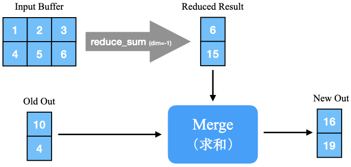

  - `reduce_max`：`new_out = max(old_out, reduced_result)`

  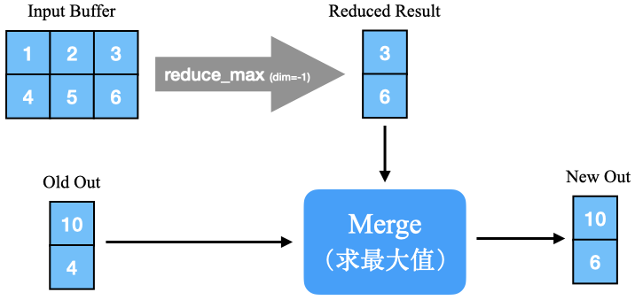

  - `reduce_min`：`new_out = min(old_out, reduced_result)`

  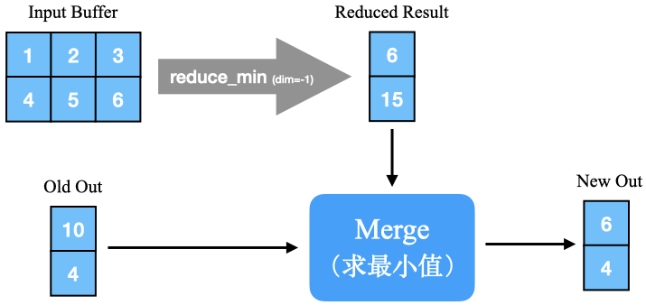

  从这三张图可以看出，`clear=False` 并不会改变 reduce 轴本身的定义，也不会改变输出 shape 的约束；它只是在 reduce 结果生成之后，再根据操作类型执行一次额外的 merge。

##### 4.1.3.3 Element-wise math类

TileLang提供了多种元素级操作算符，并结合调度原语**T.Parallel**实现Element-wise类的操作。目前支持的元素级别操作如下：

**(1) 浮点单目运算**

| 运算类别   | 运算形式        | 算符表达    | 说明                |
| ---------- | --------------- | ----------- | ------------------- |
| 绝对值     | (y = \|x\|      | T.abs(x)    | x取绝对值           |
| 指数       | (y = e^x)       | T.exp(x)    | e的x次幂            |
| 对数       | (y = log(x))    | T.log(x)    | x的对数             |
| 开平方     | (y = sqrt{x})   | T.sqrt(x)   | x取平方根           |
| 平方根倒数 | (y = 1/sqrt{x}) | T.rsqrt(x)  | x取平方根，再取倒数 |
| ReLU       | (y = max(x, 0)) | T.max(a, 0) | ReLU激活            |

**(2) 整形单目运算**

| 运算类别 | 运算形式     | 算符表达 | 说明     |
| -------- | ------------ | -------- | -------- |
| 位非     | (y = ~ x)    | ~        | 按位取非 |
| 左移     | (y = x << s) | <<       | x左移s位 |
| 右移     | (y = x >> s) | >>       | x右移s位 |

**(3) 浮点双目运算**

| 运算类别 | 运算形式        | 算符表达 | 说明         |
| -------- | --------------- | -------- | ------------ |
| 加法     | (c = a + b)     | +        | 两元素相加   |
| 减法     | (c = a - b)     | -        | 两元素相减   |
| 乘法     | (c = a * b)     | *        | 两元素相乘   |
| 除法     | (c = a / b)     | /        | 两元素相除   |
| 最小值   | (c = min(a, b)) | T.min    | 取两者最小值 |
| 最大值   | (c = max(a, b)) | T.max    | 取两者最大值 |

**(4) 整形双目运算**

| 运算类别 | 运算形式     | 算符表达 | 说明       |
| -------- | ------------ | -------- | ---------- |
| 与       | (c = a & b)  | &        | a和b按位与 |
| 或       | (c = a \| b) | \|       | a和b按位或 |


#### 4.1.2 调度原语

##### 4.1.2.1 T.Parallel

###### 4.1.2.1.1 功能介绍

在TileLang中，`T.Parallel` 是用于表达Tile内元素级并行计算的基本原语。在IR层面，它抽象出表示数据并行语义的并行循环，同时隐藏硬件细节，从而简化内核开发并提高其可移植性。

在Ascend内核中，典型的计算流程如下：

1. Split large tensors into **tiles**.
2. Load each tile into on-chip **UB (Unified Buffer)** memory.
3. Perform **Load → Compute → Store**.
4. Within the **Compute** stage, operate over all elements of a tile using vectorized instructions.

`T.Parallel`在IR层面捕获了这种“计算-阶段”向量化语义。其主要目的是为在Tile内表达向量操作提供一个统一的IR抽象。


在Ascend平台上，`T.Parallel`的设计目标如下：

- 与TileLang中间表示（IR）操作符的对齐

  在`T.Parallel`中，鼓励使用符号数学API（例如，T.exp、T.log、T.max等），而不是显式地引用低层向量操作。这样做可以确保：

  - 与TileLang 主线IR的兼容性
  - 后端可移植性（如CPU、GPU、Ascend等）

- 与Ascend架构的向量能力的协同配合

  在Ascend架构汇总，TileLang还集成了特有的扩展功能：

  - 向量原语被包装为 T.tile.xxx 形式
  - 用户可以灵活选择使用带有`T.Parallel`的符号化API（例如 +、*、T.max 等）或显式的向量内联函数（例如 `T.tile.add` 等）。

###### 4.1.2.1.2 语法格式

下面重点介绍`T.Parallel`的语法格式。

- 基础语法

  `T.Parallel` 表示元素级别的并行迭代。

  **1D Example:**

  ```
  for j in T.Parallel(block_N // VEC_NUM):
      c_ub[j] = a_ub[j] + b_ub[j]
  ```

  **2D Example:**

  ```
  for (i, j) in T.Parallel(block_M // VEC_NUM, block_N):
      c_ub[i, j] = a_ub[i, j] + b_ub[i, j]
  ```

  每次 `(i, j) `的迭代都是独立执行的，这表示该区域是可并行的。

- 复杂表达式场景

  在处理像这样的复杂表达式时：

  ```
  for (i, j) in T.Parallel(block_M // VEC_NUM, block_N):
      c_ub[i, j] = a_ub[i, j] * b_ub[i, j] + a_ub[i, j] / b_ub[i, j]
  ```

  `T.Parallel` 将分配一个临时缓冲区，以便将其分解为更简单的表达式，例如：

  ```
  for (i, j) in T.Parallel(block_M // VEC_NUM, block_N):
      c_tmp_0[i, j] = a_ub[i, j] * b_ub[i, j]
      c_tmp_1[i, j] = a_ub[i, j] / b_ub[i, j]
      c_ub[i, j] = c_tmp_0[i, j] + c_tmp_1[i, j]
  ```

  目前，临时缓冲区的大小将与Tile大小相同。因此，我们强烈建议开启自动缓冲区复用功能，以避免空间浪费。

###### 4.1.2.1.3 使用场景

- 单目操作

  见`4.1.3.3 Element-wise math类`章节说明。

- 双目操作

  见`4.1.3.3 Element-wise math类`章节说明。

- 向量-标量运算与广播机制

  `T.Parallel` 原生支持向量与标量之间的二元运算，以及沿行的广播操作。

  **Vector–Scalar Example**

  ```
  for j in T.Parallel(block_N):
      c_ub[j] = a_ub[j] + 1
  ```

  **Row-Wise Broadcast Example**

  ```
  for (i, j) in T.Parallel(block_M // VEC_NUM, block_N):
      c_ub[i, j] = a_ub[i, j] * b_ub[i]
  ```

  - `a_ub.shape = (block_M // VEC_NUM, block_N)`
  - `b_ub.shape = (block_M // VEC_NUM,)`

- 列切分模式

  `T.Parallel`可以灵活地将顺序（行）维度和并行（列）维度结合起来。

  ```
  for i in range(block_M // VEC_NUM):  # Row sequential
      for j in T.Parallel(block_N):    # Column parallel
          c_ub[i, j] = a_ub[i, j] * b_ub[i, j]
  ```

  这使得在不需要完全分块时也能实现部分并行化。

- 操作数与结果维度不匹配

  `T.Parallel` 能够处理操作数与结果维度不匹配，可以对等号右侧广播到与左侧一样的维度

  ```python
  for (i, j) in T.Parallel(block_M // VEC_NUM, block_N):
      c_ub[i, j] = b_ub[j] + 5 # b_ud is 1d and c_ub is 2d
  ``` 

###### 4.1.2.1.4 两种编程范式的说明

在Ascend平台上，对于Tile级别的操作，`T.Parallel`和`T.tile.xxx`两种编程范式都支持。

- T.Parallel结合符号API

  高级别表达注重清晰性和可移植性。这种方法使用符号API在Tile区域上执行数据并行计算。

  ```
  @T.prim_func
  def main(A: T.Buffer((M, N), "float16"), B: T.Buffer((M, N), "float16")):
      with T.Scope("V"):
          a_ub = T.alloc_ub((block_M // VEC_NUM, block_N), "float16")
          b_ub = T.alloc_ub((block_M // VEC_NUM, block_N), "float16")
  
          T.copy(A, a_ub)
  
          for (i, j) in T.Parallel(block_M // VEC_NUM, block_N):
              b_ub[i, j] = T.exp(a_ub[i, j])
  
          T.copy(b_ub, B)
  ```

- Tile扩展原语

  这种方式直接触发调用Tile级的vector操作指令。

  ```
  @T.prim_func
  def main(A: T.Buffer((M, N), "float16"), B: T.Buffer((M, N), "float16")):
      with T.Scope("V"):
          T.copy(A, a_ub)
          T.tile.exp(b_ub, a_ub)
          T.copy(b_ub, B)
  ```

##### 4.1.2.2 T.Pipelined

###### 4.1.2.2.1 功能介绍

`T.pipelined` 是 TileLang中的一个高级抽象，旨在表达和优化 Ascend AI 加速器上的流水线并行计算。它能够实现细粒度的计算重叠、单核内（intra-core）的内存访问重叠，以及多核之间（inter-core）的跨执行同步。

###### 4.1.2.2.2 语法格式

**语法格式**：

```
for var in T.Pipelined(range: int, num_stages: int):
```

假设某些操作需要循环迭代执行，该语句能够为这些循环内的操作开启流水线，通过设置`num_stages`的不同取值（`num_stages`是一个小于`range-1`的正整数）来控制重叠度。

###### 4.1.2.2.2 使用场景

- **Intra-core case**

  ```
  for k in T.Pipelined(loop_k, num_stages=2):
      T.copy(A[bx * block_M, k * block_K], A_L1)
      T.copy(B[k * block_K, by * block_N], B_L1)
  
      T.barrier_all()
      if k == 0:
          T.gemm_v0(A_L1, B_L1, C_L0, init=True)
      else:
          T.gemm_v0(A_L1, B_L1, C_L0)
  
      T.barrier_all()
  ```

  在上例中，一个循环内包含两次内存访问和一次计算：`copy_A`、`copy_B` 和 `gemm`。假设 loop_k = 4，则这些操作的顺序为：

  ```
  loop 0 : copy_A_0 --> copy_B_0 --> gemm_0
  loop 1 : copy_A_1 --> copy_B_1 --> gemm_1
  loop 2 : copy_A_2 --> copy_B_2 --> gemm_2
  loop 3 : copy_A_3 --> copy_B_3 --> gemm_3
  ```

  在一个循环中，`gemm`依赖于`copy_A`和`copy_B`。但循环迭代之间不存在数据依赖关系。通过采用预取-主体-尾部的流水线方式，可以实现计算与访存的重叠，从而显著提升内存密集型算子的性能。

  当`num_stages=2`时，任务的执行顺序如下：

  | Time | Copy A       | Copy B       | Compute    |
  | ---- | ------------ | ------------ | ---------- |
  | t₀   | **copy_A_0** | **copy_B_0** |            |
  | t₁   | **copy_A_1** | **copy_B_1** |            |
  | t₂   | **copy_A_2** | **copy_B_2** | **gemm_0** |
  | t₃   | **copy_A_3** | **copy_B_3** | **gemm_1** |
  | t₄   |              |              | **gemm_2** |
  | t₅   |              |              | **gemm_3** |

  在本例中，`num_stages=2`，表示预取2次内存访问。
  预取阶段：`copy_A_0 copy_A_1` 和 `copy_B_0 copy_B_1`
  主体阶段：`copy_A_2 copy_B_2 gemm_0` 和 `copy_A_3 copy_B_3 gemm_1`
  尾端阶段：`gemm_2` 和 `gemm_3`

  计算和访存主体上相互重叠。

- **Inter-core case**

  ```
  for k in T.Pipelined(T.ceildiv(seq_len, block_N), num_stages=2):
      T.copy(K[bz, by, k * block_N:(k + 1) * block_N, :], k_l1)
      T.gemm_v0(q_l1, k_l1, acc_s_l0c, transpose_B=True, init=True)
      T.copy(acc_s_l0c, workspace_1[cid, :, :])
  
      T.tile.fill(acc_s_ub, 0.0)
      T.copy(m_i, m_i_prev)
      T.copy(
          workspace_1[cid, vid * block_M // 2:vid * block_M // 2 + block_M // 2, :],
          acc_s_ub_)
      T.tile.add(acc_s_ub, acc_s_ub, acc_s_ub_)
      T.tile.mul(acc_s_ub, acc_s_ub, sm_scale)
      ...
  ```
  
  在上述案例中，在Cube核心上执行的`copy_K`、`gemm`和`copy_l0c_to_wk1`操作统称为`write_wk1`。在Vevtor核心上执行的以下操作中，包含`copy_wk1_to_ub`的操作可称为`read_wk1`。假设`T.ceildiv(seq_len, block_N)=4`，则这些操作为：
  
  ```
  loop 0 : write_wk1_0 --> read_wk1_0
  loop 1 : write_wk1_1 --> read_wk1_1
  loop 2 : write_wk1_2 --> read_wk1_2
  loop 3 : write_wk1_3 --> read_wk1_3
  ```
  
  此时`num_stages=2` ，即同时发出两个`write_wk1`任务，任务的执行顺序如下：
  
  | Time | Write Workspace | Read Workspace |
  | ---- | --------------- | -------------- |
  | t₀   | **write_wk1_0** |                |
  | t₁   | **write_wk1_1** | **read_wk1_0** |
  | t₂   | **write_wk1_2** | **read_wk1_1** |
  | t₃   | **write_wk1_3** | **read_wk1_2** |
  | t₄   |                 | **read_wk1_3** |

Cube和Vector的操作在t1~t3之间存在相互重叠。


**注意事项**：

- 核间流水线与核内流水线不能同时开启。
- 使用核间流水线时，必须开启自动CV分离和自动CV间同步插入功能：`"tl.ascend_auto_cv_combine": True, "tl.ascend_auto_cross_core_sync": True`

##### 4.1.2.3 T.Persistent

###### 4.1.2.3.1 功能介绍

通常情况下，大的数据会被切分成多个小的块来处理，但对这些数据块的调度处理不同可能带来的性能也会不同。例如，如果这些数据块是分批次来调度，即一组相邻的数据块交由相同的AI core来处理，这样让加载的数据更容易命中缓存；相反，如果随机调度，则会导致缓存数据的反复换入换出，从而导致cache带宽的浪费。T.Persistent原语就是通过对数据块在AI core间的调度策略进行了优化处理，从而对缓存更友好。

4.1.2.3.2 使用举例

```
with T.Kernel(m_num * n_num, is_npu=True) as (cid, _):
    A_L1 = T.alloc_shared((block_M, K_L1), dtype)
    B_L1 = T.alloc_shared((K_L1, block_N), dtype)
    C_L0 = T.alloc_fragment((block_M, block_N), accum_dtype)

    for bx, by in T.Persistent([T.ceildiv(M, block_M), T.ceildiv(N, block_N)],
        core_num, cid):
        loop_k = T.ceildiv(K, K_L1)
        for k in T.serial(loop_k):
            T.copy(A[bx * block_M, k * K_L1], A_L1)
            T.copy(B[k * K_L1, by * block_N], B_L1)
            T.gemm_v0(A_L1, B_L1, C_L0, init=(k == 0))
            T.copy(C_L0, C[bx * block_M, by * block_N])
     ...
```

### 4.2 Expert模式

Expert模式编程的含义是可以像专家那样去写算子，可以调用很多平台相关的硬件接口和能力，例如同步的缓存控制、寄存器控制、同步插入的精确控制等，这通常是为了追求极致的性能。通常情况下，会是Developer和Expert两种方式结合的混合编程方式。

#### 4.2.1 内存分配原语

在Ascend平台中，有多种内存层级的Buffer，在专家模式编程中为每一种内存层级的buffer有单独的分配原语。


- `T.alloc_ub(shape, dtype)`:

  **参数**：

  - shape：The shape of the buffer to allocate 
  - dtype：The data type of the buffer (e.g., ‘float32’, ‘int32’)

  **功能说明**：在Unified Buffer存储中申请形状为shape，类型为dtype的内存空间。

  **举例**：

  ```
  a_ub = T.alloc_ub((block_M, block_N), 'int16')
  ```

- `T.alloc_L1(shape, dtype)`:

  **参数**：

  - shape：The shape of the buffer to allocate
  - dtype：The data type of the buffer (e.g., ‘float32’, ‘int32’)

  **功能说明**：在L1 buffer存储中申请形状为shape，类型为dtype的内存空间。

  **举例**：

  ```
  A_L1 = T.alloc_L1((block_M, K_L1), dtype)
  ```

- `T.alloc_L0A(shape, dtype)`:

  **参数**：

  - shape：The shape of the buffer to allocate
  - dtype：The data type of the buffer (e.g., ‘float32’, ‘int32’)

  **功能说明**：在L0A buffer存储中申请形状为shape，类型为dtype的内存空间。

  **举例**：

  ```
  A_L0 = T.alloc_L0A((block_M, K_L1), dtype)
  ```

- `T.alloc_L0B(shape, dtype)`:

  **参数**：

  - shape：The shape of the buffer to allocate
  - dtype：The data type of the buffer (e.g., ‘float32’, ‘int32’)

  **功能说明**：在L0B buffer存储中申请形状为shape，类型为dtype的内存空间。

  **举例**：

  ```
  B_L0 = T.alloc_L0B((block_M, K_L1), dtype)
  ```

- `T.alloc_L0C(shape, dtype)`:

  **参数**：

  - shape：The shape of the buffer to allocate
  - dtype：The data type of the buffer (e.g., ‘float32’, ‘int32’)

  **功能说明**：在L0C buffer存储中申请形状为shape，类型为dtype的内存空间。

  **举例**：

  ```
  C_L0 = T.alloc_L0C((block_M, block_N), accum_dtype)
  ```

#### 4.1.2 数据搬运原语

Expert模式的数据搬运原语同Developer模式。

#### 4.1.3 计算原语

##### 4.1.3.1 通用计算原语

###### 4.1.3.1.1 矩阵计算

Expert编程模式可以复用Developer模式的矩阵计算原语。

###### 4.1.3.1.2 Reduce

Expert编程模式可以复用Developer模式的Reduce类计算原语。

##### 4.1.3.2 扩展计算原语

除了可以复用Developer模式提供的通用的计算原语外，Expert模式还里还提供了一些扩展的计算原语。

###### 4.1.3.2.1 数学计算

**数学计算汇总**：

| 名称       | 语法格式                                 | 描述                                                         |
| ---------- | ---------------------------------------- | ------------------------------------------------------------ |
| 加法       | T.tile.add(dst, src0, src1)              | element-wise加法，dst = src0 + src1                          |
| 减法       | T.tile.sub(dst, src0, src1)              | element-wise减法，dst = src0 - src1                          |
| 乘法       | T.tile.mul(dst, src0, src1)              | element-wise法乘，dst = src0 * src1                          |
| 除法       | T.tile.div(dst, src0, src1)              | element-wise法乘，dst = src0 / src1                          |
| 最大值     | T.tile.max(dst, src0, src1)              | element-wise 求max，dst = max(src0, src1)                    |
| 最小值     | T.tile.min(dst, src0, src1)              | element-wise 求min，dst = min(src0, src1)                    |
| 指数       | T.tile.exp(dst, src0)                    | element-wise 取自然指数，dst = exp(src0)                     |
| 对数       | T.tile.ln(dst, src0)                     | element-wise 取自然对数，dst = ln(src0)                      |
| 绝对值     | T.tile.abs(dst, src0)                    | element-wise 取绝对值，dst = abs(src0)                       |
| 倒数       | T.tile.reciprocal(dst, src0)             | element-wise 取倒数，dst = 1 / src0                          |
| 开平方     | T.tile.sqrt(dst, src0)                   | element-wise 开平方根，dst = sqrt(src0)                      |
| 平方根倒数 | T.tile.rsqrt(dst, src0)                  | element-wise 取平方根的倒数，dst = 1 / sqrt(src0)            |
| ReLU       | T.tile.relu(dst, src0)                   | element-wise 进行ReLU激活计算，dst = max(0, src0)            |
| LeakeyReLU | T.tile.leaky_relu(dst, src0, scalar)     | element-wise 进行Leaky ReLU激活计算，dst = src0 if src0 >= 0 else src0 * scalar |
| AXPY       | T.tile.axpy(dst, src0, scalar)           | element-wise 进行AXPY计算，dst = scalar * src0 + dst         |
| 正弦       | T.tile.sin(dst, src0)               | element-wise 进行sin计算，dst = sin(src)                     |
| 余弦       | T.tile.cos(dst, src0)               | element-wise 进行cos计算，dst = sin(src)                     |
| 与         | T.tile.bitwise_and(dst, src0, src1)      | element-wise bitwise AND，dst = src0 & src1                  |
| 或         | T.tile.bitwise_or(dst, src0, src1)       | element-wise bitwise OR，dst = src0                          |
| 非         | T.tile.bitwise_not(dst, src0)            | element-wise bitwise NOT，dst = ~src0                        |
| 异或       | T.tile.bitwise_xor(dst, src0, src1)      | element-wise bitwise XOR，dst = src0 ^ src1                  |
| 左移       | T.tile.bitwise_lshift(dst, src0, scalar) | element-wise 左移操作                                        |
| 右移       | T.tile.bitwise_rshift(dst, src0, scalar) | element-wise 右移操作                                        |
| 原子累加   | T.tile.atomic_add(dst, src)              | 将本地 tensor 原子累加到 GM，V1 支持 local/UB → GM           |

**(1) 基础算术**

- `T.tile.add(dst, src0, src1)`:

  **参数**：

  - dst：计算结果存放目的buffer
  - src0: 操作数1，数据类型为buffer类型
  - src1: 操作数2，数据类型可以为buffer类型，也可以是scalar类型

  **功能**：element-wise加法，dst = src0 + src1

  **举例**：

  ```
  #a_ub和b_ub逐元素相加，结果存放到c_ub
  T.tile.add(c_ub, a_ub, b_ub)
  
  #a_ub逐元素加2，结果存放到c_ub
  T.tile.add(c_ub, a_ub, 2)
  ```

- `T.tile.sub(dst, src0, src1)`:

  **参数**：

  - dst：计算结果存放目的buffer
  - src0: 操作数1，数据类型为buffer类型
  - src1: 操作数2，数据类型可以为buffer类型，也可以是scalar类型

  **功能**：element-wise减法，dst = src0 - src1

  **举例**：

  ```
  #a_ub和b_ub的逐元素相减，结果存放到c_ub
  T.tile.sub(c_ub, a_ub, b_ub)
  
  #a_ub的每个元素减去2，结果存放到c_ub
  T.tile.sub(c_ub, a_ub, 2)
  ```

- `T.tile.mul(dst, src0, src1)`:

  **参数**：

  - dst：计算结果存放目的buffer
  - src0: 操作数1，数据类型为buffer类型
  - src1: 操作数2，数据类型可以为buffer类型，也可以是scalar类型

  **功能**：element-wise法乘，dst = src0 * src1

  **举例**：

  ```
  #a_ub和b_ub的逐元素相乘，结果存放到c_ub
  T.tile.mul(c_ub, a_ub, b_ub)
  
  #a_ub的每个元素乘2，结果存放到c_ub
  T.tile.mul(c_ub, a_ub, 2)
  ```

- `T.tile.div(dst, src0, src1)`:

  **参数**：

  - dst：计算结果存放目的buffer
  - src0: 操作数1，数据类型为buffer类型
  - src1: 操作数2，数据类型可以为buffer类型，也可以是scalar类型

  **功能**：element-wise法乘，dst = src0 / src1

  **举例**：

  ```
  #a_ub和b_ub的逐元素相除，结果存放到c_ub
  T.tile.div(c_ub, a_ub, b_ub)
  
  #a_ub的每个元素除以2，结果存放到c_ub
  T.tile.div(c_ub, a_ub, 2)
  ```

- `T.tile.max(dst, src0, src1)`:

  **参数**：

  - dst：计算结果存放目的buffer
  - src0: 操作数1，数据类型为buffer类型
  - src1: 操作数2，数据类型可以为buffer类型，也可以是scalar类型

  **功能**：element-wise 求max，dst = max(src0, src1)

  **举例**：

  ```
  #a_ub和b_ub的逐元素求max，结果存放到c_ub
  T.tile.max(c_ub, a_ub, b_ub)
  
  #a_ub的每个元素和2比较，取最大值，结果存放到c_ub
  T.tile.max(c_ub, a_ub, 2)
  ```

- `T.tile.min(dst, src0, src1)`:

  **参数**：

  - dst：计算结果存放目的buffer
  - src0: 操作数1，数据类型为buffer类型
  - src1: 操作数2，数据类型可以为buffer类型，也可以是scalar类型

  **功能**：element-wise 求min，dst = min(src0, src1)

  **举例**：

  ```
  #a_ub和b_ub的逐元素求min，结果存放到c_ub
  T.tile.min(c_ub, a_ub, b_ub)
  
  #a_ub的每个元素和2比较，取最小值，结果存放到c_ub
  T.tile.min(c_ub, a_ub, 2)
  ```

- `T.tile.exp(dst, src0)`:

  **参数**：

  - dst：计算结果存放目的buffer
  - src0：源操作数，数据类型为buffer类型

  **功能**：element-wise 取自然指数，dst = exp(src0)

  **举例**：

  ```
  #a_ub逐元素取自然指数，结果存放到c_ub
  T.tile.exp(c_ub, a_ub)
  ```

- `T.tile.ln(dst, src0)`:

  **参数**：

  - dst：计算结果存放目的buffer
  - src0：源操作数，数据类型为buffer类型

  **功能**：element-wise 取自然对数，dst = ln(src0)

  **举例**：

  ```
  #a_ub逐元素取自然对数，结果存放到c_ub
  T.tile.ln(c_ub, a_ub)
  ```

- `T.tile.abs(dst, src0)`:

  **参数**：

  - dst：计算结果存放目的buffer
  - src0：源操作数，数据类型为buffer类型

  **功能**：element-wise 取绝对值，dst = abs(src0)

  **举例**：

  ```
  #a_ub逐元素取绝对值，结果存放到c_ub
  T.tile.abs(c_ub, a_ub)
  ```

- `T.tile.reciprocal(dst, src0)`:

  **参数**：

  - dst：计算结果存放目的buffer
  - src0：源操作数，数据类型为buffer类型

  **功能**：element-wise 取倒数，dst = 1 / src0

  **举例**：

  ```
  #a_ub逐元素取倒数，结果存放到c_ub
  T.tile.reciprocal(c_ub, a_ub)
  ```

- `T.tile.sqrt(dst, src0)`:

  **参数**：

  - dst：计算结果存放目的buffer
  - src0：源操作数，数据类型为buffer类型

  **功能**：element-wise 开平方根，dst = sqrt(src0)

  **举例**：

  ```
  #a_ub逐元素开平方根，结果存放到c_ub
  T.tile.sqrt(c_ub, a_ub)
  ```

- `T.tile.rsqrt(dst, src0)`:

  **参数**：

  - dst：计算结果存放目的buffer
  - src0：源操作数，数据类型为buffer类型

  **功能**：element-wise 取平方根的倒数，dst = 1 / sqrt(src0)

  **举例**：

  ```
  #a_ub逐元素取平方根的倒数，结果存放到c_ub
  T.tile.rsqrt(c_ub, a_ub)
  ```

- `T.tile.relu(dst, src0)`:

  **参数**：

  - dst：计算结果存放目的buffer
  - src0：源操作数，数据类型为buffer类型

  **功能**：element-wise 进行ReLU激活计算，dst = max(0, src0)

  **举例**：

  ```
  #a_ub逐元素进行ReLU激活计算，结果存放到c_ub
  T.tile.relu(c_ub, a_ub)
  ```

- `T.tile.leaky_relu(dst, src0, scalar)`:

  **参数**：

  - dst：计算结果存放目的buffer
  - src0：源操作数，数据类型为buffer类型
  - scalar：负斜率系数

  **功能**：element-wise 进行Leaky ReLU激活计算，dst = src0 if src0 >= 0 else src0 * scalar

  **举例**：

  ```
  #a_ub逐元素进行Leaky ReLU激活计算，结果存放到c_ub
  T.tile.leaky_relu(c_ub, a_ub)
  ```

- `T.tile.axpy(dst, src0, scalar)`:

  **参数**：

  - dst：计算结果存放目的buffer
  - src0：源操作数，数据类型为buffer类型
  - scalar：源操作数乘的系数

  **功能**：element-wise 进行AXPY计算，dst = scalar * src0 + dst.

  **举例**：

  ```
  #a_ub逐元素进行axpy计算，结果存放到c_ub
  T.tile.axpy(c_ub, a_ub, scalar)
  ```

- `T.tile.sin(dst, src0)`:

  **参数**：

  - dst：计算结果存放目的buffer
  - src0：源操作数，数据类型为buffer类型

  **功能**：element-wise 进行sin计算，dst = sin(src)

  **举例**：

  ```
  #a_ub逐元素进行sin计算，结果存放到c_ub
  T.tile.sin(c_ub, a_ub)
  ```

- `T.tile.cos(dst, src0)`:

  **参数**：

  - dst：计算结果存放目的buffer
  - src0：源操作数，数据类型为buffer类型

  **功能**：element-wise 进行cos计算，dst = cos(src)

  **举例**：

  ```
  #a_ub逐元素进行计算cos，结果存放到c_ub
  T.tile.cos(c_ub, a_ub)
  ```

**(2) 逻辑计算**

- `T.tile.bitwise_and(dst, src0, src1)`:

  **参数**：

  - dst：计算结果存放目的buffer
  - src0：操作数1，数据类型为buffer类型
  - src1：操作数2，数据类型为buffer类型

  **功能**：element-wise bitwise AND，dst = src0 & src1

  **举例**：

  ```
  #a_ub和b_ub逐元素按位进行逻辑与操作，结果存放到c_ub
  T.tile.bitwise_and(c_ub, a_ub, b_ub)
  ```

- `T.tile.bitwise_or(dst, src0, src1)`:

  **参数**：

  - dst：计算结果存放目的buffer
  - src0：操作数1，数据类型为buffer类型
  - src1：操作数2，数据类型为buffer类型

  **功能**：element-wise bitwise OR，dst = src0 | src1

  **举例**：

  ```
  #a_ub和b_ub逐元素按位进行逻辑或操作，结果存放到c_ub
  T.tile.bitwise_or(c_ub, a_ub, b_ub)
  ```

- `T.tile.bitwise_not(dst, src0)`:

  **参数**：

  - dst：计算结果存放目的buffer
  - src0：操作数1，数据类型为buffer类型

  **功能**：element-wise bitwise NOT，dst = ~src0

  **举例**：

  ```
  #a_ub逐元素按位取非，结果存放到c_ub
  T.tile.bitwise_not(c_ub, a_ub)
  ```

- `T.tile.bitwise_xor(dst, src0, src1)`:

  **参数**：

  - dst：计算结果存放目的buffer
  - src0：操作数1，数据类型为buffer类型
  - src1：操作数2，数据类型为buffer类型

  **功能**：element-wise bitwise XOR，dst = src0 ^ src1

  **举例**：

  ```
  #a_ub和b_ub逐元素按位进行逻辑异或操作，结果存放到c_ub
  T.tile.bitwise_xor(c_ub, a_ub, b_ub)
  ```

- `T.tile.bitwise_lshift(dst, src0, scalar)`:

  **参数**：

  - dst：计算结果存放目的buffer
  - src0：源操作数，数据类型为buffer类型
  - scalar：左移位数

  **功能**：element-wise 左移操作

  **举例**：

  ```
  #a_ub左移1位，结果存放到c_ub
  T.tile.bitwise_lshift(c_ub, a_ub, 1)
  ```

- `T.tile.bitwise_rshift(dst, src0, scalar)`:

  **参数**：

  - dst：计算结果存放目的buffer
  - src0：源操作数，数据类型为buffer类型
  - scalar：右移位数

  **功能**：element-wise 右移操作

  **举例**：

  ```
  #a_ub右移1位，结果存放到c_ub
  T.tile.bitwise_rshift(c_ub, a_ub, 1)
  ```

###### 4.1.3.2.2 比较

- `T.tile.compare(dst, src0, src1, mode)`:

  **参数**：

  - dst：计算结果存放目的buffer
  - src0：源操作数1，数据类型为buffer类型
  - src1：源操作数2，数据类型为buffer类型或scalar标量
  - mode：比较模式
    - "EQ"：src0等于（equal to）src1
    - "NE"：src0不等于（not equal to）src1
    - "GT"：src0大于（greater than）src1
    - "GE"：src0大于或等于（greater than or equal to）src1
    - "LT"：src0小于（less than）src1
    - "LE"：src0小于或等于（less than or equal to）src1

  **功能**：逐元素比较两个tensor大小，如果比较后的结果为真，则输出结果的对应比特位为1，否则为0。

  **举例**：

  ```
  # a_ub和b_ub逐元素比较，如果相等则相应位置置1，否则为0
  T.tile.compare(c_ub, a_ub, b_ub, “EQ”)
  
  # a_ub逐元素和浮点数1.0比较，如果相等则相应位置置1，否则为0
  T.tile.compare(c_ub, a_ub, 1.0, "EQ")
  ```

###### 4.1.3.2.3 选择

- `T.tile.select(dst, selMask, src0, src1, selMode)`:

  **参数**：

  - dst：计算结果存放目的buffer
  - selMask：selection掩码
  - src0：源操作数1，数据类型为buffer类型
  - src1：源操作数2，数据类型为buffer类型或scalar类型
  - selMode：selection mode
    - 'VSEL_CMPMASK_SPR'：根据selMask在两个tensor中选取元素。selMask中有效数据的个数存在限制，具体取决于源操作数的数据类型。在每一轮迭代中，根据selMask的有效位数据进行选择操作，每一轮迭代采用的selMask，均为相同数值，即selMask的有效数值。
    - 'VSEL_TENSOR_SCALAR_MODE'：根据selMask在1个tensor和1个scalar标量中选取元素，selMask无有效数据限制。多轮迭代时，每轮迭代连续使用selMask的不同部分。
    - 'VSEL_TENSOR_TENSOR_MODE'：根据selMask在两个tensor中选取元素，selMask无有效数据限制。多轮迭代时，每轮迭代连续使用selMask的不同部分。

  **功能**：给定两个源操作数src0和src1，根据selMask（用于选择的Mask掩码）的比特位值选取元素，得到目的操作数dst。选择的规则为：当selMask的比特位是1时，从src0中选取，比特位是0时从src1选取。

  更详细的说明可以参加AscendC手册描述：https://www.hiascend.com/document/detail/zh/CANNCommunityEdition/83RC1alpha002/API/ascendcopapi/atlasascendc_api_07_0070.html

  **举例**：

  ```
  # 基于selMask设置，从a_ub和b_ub中选择元素，结果存放到c_ub
  T.tile.select(c_ub, selmask_ub, a_ub, b_ub, "VSEL_CMPMASK_SPR")
  
  # 根据selMask设置，从a_ub和scalar值1.0中选择，结果存放到c_ub
  T.tile.select(c_ub, selmask_ub, a_ub, 1.0, "VSEL_TENSOR_SCALAR_MODE")
  ```

- `T.tile.gather_mask(dst, src, src1Pattern):`

  **参数**：

  - dst：计算结果存放目的buffer
  - src：源操作数，数据类型为buffer类型
  - src1Pattern: 数据收集的掩码，分为两种模式，固定模式和自定义模式
    当固定模式时，src1Pattern为字符串类型，可以输入如下配置:
    - "P0101": 按偶数索引元素
    - "P1010": 按奇数索引元素
    - "P0001": 每四个元素取第一个元素
    - "P0010": 每四个元素取第二个元素
    - "P0100": 每四个元素取第三个元素
    - "P1000": 每四个元素取第四个元素
    - "P1111": 取全部元素
    当自定义模式时，src1Pattern为buffer类型，根据索引选取元素

  **功能**：给定一个源操作数，根据src1Pattern的不同配置（固定模式或自定义模式）选取元素，得到目的操作数dst。

  **举例**：
  ```
  # 基于src1Pattern固定模式，从a_ub中按偶数索引选择元素，结果存放到b_ub
  T.tile.gather_mask(b_ub, a_ub, "P0101")
  # 基于src1Pattern自定义模式，从a_ub中按idx中索引号选择元素，结果存放到b_ub
  idx = [0, 1, 3, 4, 5, 7, 8, 9]
  T.tile.gather_mask(b_ub, a_ub, idx)
  ```

###### 4.1.3.2.4 精度转换

- `T.tile.cast(dst, src, mode, count)：`

  **参数**：

  - dst：计算结果存放目的buffer
  - src：源操作数
  - mode：
    - "CAST_NONE"
    - "CAST_RINT"
    - "CAST_FLOOR"
    - "CAST_CEIL"
    - "CAST_ROUND"
    - "CAST_TRUNC"
    - "CAST_ODD"
  - count：参与计算元素个数

  **功能**：根据源操作数和目的操作数Tensor的数据类型进行精度转换。

  更详细说明见AscendC文档：https://www.hiascend.com/document/detail/zh/CANNCommunityEdition/83RC1alpha002/API/ascendcopapi/atlasascendc_api_07_0073.html

  **举例**：

  ```
  T.tile.cast(b_ub, a_ub, "CAST_RINT", 4096)
  ```

###### 4.1.3.2.5 数据转换

- `T.tile.transpose(dst, src)：`

  **参数**：

  - dst：计算结果存放目的buffer
  - src：源操作数

  **功能**：当前仅支持用于实现16*16的二维矩阵数据块转置。更完毕功能待完善。

  **举例**：

  ```
  T.tile.transpose(b_ub, a_ub)
  ```

###### 4.1.3.2.6 数据填充

- `T.tile.fill(buffer, value):`

  **参数**：

  - buffer：要填充的数据buffer
  - value：要填充的值

  **功能**：用指定的value值填充数据buffer。

  **举例**：

  ```
  T.tile.fill(zero_ub, 0.0)
  ```
  
- `T.tile.createvecindex(dst, first_value)：`

  **参数**：

  - dst：计算结果存放目的buffer
  - first_value：索引的第一个数值

  **功能**：创建指定起始值的向量索引。

  **举例**：

  ```
  # 创建从0开始的向量索引，最初c_ub为：[0 1 2 ... 127]
  T.tile.createvecindex(c_ub, 0)
  ```

###### 4.1.3.2.7 排序组合

- `T.tile.sort(dst, src, actual_num):`

  **参数**：

  - dst：存储排序后结果的目标缓冲区(val0, index0, val1, index1 ,...)
  - src：源操作数，待排序数据(val0, val1, val2, ...)
  - actual_num：src 中实际参与排序的元素数量

  **功能**：排序函数，将任意长度数据按照数值大小进行一次性降序排序

  **举例**：

  ```
  # 对131个数进行排序
  # 131向上对齐到160，src.shape = (1, 160), actual_num = 131
  T.tile.sort(dst, src, actual_num)
  ```

  **注意事项**：
  - `dst`与 `src` 数据类型相同，仅支持float32和float16数据类型
  - `src` 的大小需要满足32或32的整数倍

- `T.tile.merge_sort(dst, src0, src1, src2=None, src3=None):`

  **参数**：

  - dst：归并结果输出缓冲区
  - tmp：临时缓冲区，用于归并计算的中间结果存储
  - src0：第一个已排序的源数据缓冲区
  - src1：第二个已排序的源数据缓冲区
  - src2：第三个已排序的源数据缓冲区（可选，3-way 或 4-way 归并时需要）
  - src3：第四个已排序的源数据缓冲区（可选，4-way 归并时需要）

  **功能**：将多个已排序的数据块合并为一个有序结果，支持 2-way、3-way 和 4-way 归并排序。

  **数据格式**：输入/输出格式均为 value-index pair：`[value0, index0, value1, index1, value2, index2, ...]`，按降序排列。

  数据类型为float，每个结构占据8Bytes：

  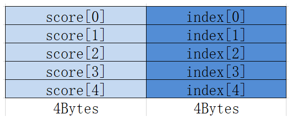

  数据类型为half，每个结构也占据8Bytes，中间有2Bytes保留：
  
  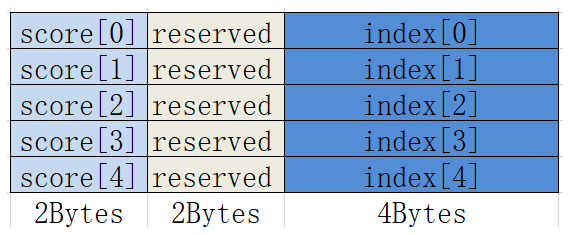

  **举例**：

  ```python
  # 2-way 归并
  T.tile.merge_sort(merge_dst, src0, src1)

  # 3-way 归并
  T.tile.merge_sort(merge_dst, src0, src1, src2)

  # 4-way 归并
  T.tile.merge_sort(merge_dst, src0, src1, src2, src3)
  ```

  **注意事项**：
  - `tmp` 缓冲区大小需与 `dst` 相同
  - 输入缓冲区必须已按降序排序
  - 所有缓冲区的数据格式必须为 value-index pair（每 2 个 float 表示一个元素）
  - 建议配合 `T.tile.sort32` 一起使用

  更详细说明，详见AscendC文档：https://www.hiascend.com/document/detail/zh/CANNCommunityEdition/83RC1alpha002/API/ascendcopapi/atlasascendc_api_07_0232.html

- `T.tile.topk(dst, src, K, actual_num):`

  **参数**：

  - dst：存储TopK结果的目标缓冲区(val0, index0, val1, index1 ,...)
  - src：包含输入数据的源缓冲区(val0, val1, val2, ...)
  - K：前K个排序结果
  - actual_num：实际参与排序的元素个数

  **功能**：执行 TopK 操作，实现对源数据的一次性从大到小排序，选择前K个元素，以（数、索引）的方式输出

  **举例**:

  ```
  # 对41个数进行排序，选择前10个数
  # 需要使41向上对齐至32 * 2 = 64，K = 10, actual_num = 41
  # topk_global.shape = (1, 20)sort_result.shape = (1, 64)
  T.tile.topk(topk_global, sort_result, K, actual_num)
  ```

  **注意事项**：
  - `src` 的大小需要满足32或32的整数倍

###### 4.1.3.2.8 数据分散/收集

- `T.tile.gather(dst, src, src_offset, src_base_addr):`

  **参数**：

  - dst：收集的数据将存储到的目标缓冲区
  - src：包含数据表的源缓冲区
  - src_offset：包含用于聚集的偏移量/索引的缓冲区
  - src_base_addr：需要添加到聚集索引中的基地址偏移量

  **功能**：给定输入的张量和一个地址偏移张量，本接口根据偏移地址将输入张量按元素收集到结果张量中。

  更详细说明，详见AscendC文档：https://www.hiascend.com/document/detail/zh/CANNCommunityEdition/83RC1alpha002/API/ascendcopapi/atlasascendc_api_07_0092.html

  **举例**：

  ```
  T.tile.gather(c_ub, a_ub, b_ub, 0)
  ```

###### 4.1.3.2.9 索引操作

- `T.tile.arith_progression(buffer, first_value, diff_value, count):`

  **参数**：

  - buffer：序列将被存储的目标缓冲区
  - first_value：等差数列的起始值
  - diff_value：相邻值之间的差值（步长）
  - count：要生成的元素数量

  **功能**：给定起始值，等差值和长度，返回一个等差数列。

  更详细说明，详见AscendC文档：https://www.hiascend.com/document/detail/zh/CANNCommunityEdition/83RC1alpha002/API/ascendcopapi/atlasascendc_api_07_0856.html

  **举例**：

  ```
  T.tile.arith_progression(sort_indices, 0, 1, block_N)
  ```

###### 4.1.3.2.10 数据清除

- `T.tile.clear(buffer):`

  **参数**：

  - buffer：要填充的数据buffer

  **功能**：将数据buffer填充为0，实现buffer清空操作。

  **举例**：

  ```
  T.tile.clear(ub);
  ```

###### 4.1.3.2.11 原子操作

- `T.tile.atomic_add(dst, src):`

  **参数**：

  - dst：GM 目标 buffer、buffer load 或 region
  - src：本地 tensor，当前主要支持 UB/shared buffer

  **功能**：将本地 tensor tile 原子累加到 GM 目标区域。该接口是 Ascend 专属的 `T.tile` 原语，不等价于主仓 GPU 风格的全局 `T.atomic_add`。V1 只支持 local/UB 到 GM 的原子累加，不支持 `return_prev`、`memory_order`、`use_tma`、常量 src 或任意表达式 src。

  底层会生成 Ascend C 的 DMA atomic add 语义：开启 `SetAtomicAdd<T>()`，执行 local 到 GM 的 `DataCopyPad`，再通过兼容 helper 关闭 atomic 状态。CANN 9.x 使用 `DisableDmaAtomic()`，CANN 8.5 走 `SetAtomicNone()`。

  **举例**：

  ```python
  pass_configs = {
      tilelang.PassConfigKey.TL_ASCEND_AUTO_SYNC: True,
      tilelang.PassConfigKey.TL_ASCEND_MEMORY_PLANNING: True,
  }

  src_ub = T.alloc_ub((tile_n,), "float32")
  T.tile.fill(src_ub, 1.0)
  T.tile.atomic_add(C[0], src_ub)
  ```

  **注意事项**：

  - 如果期望结果从 0 开始累加，调用 kernel 前或 kernel 内必须先清零 GM 输出。
  - 该接口可在 Developer pass_configs 下按混合模式使用，不要求额外手写 `T.Scope("V")` 或 `T.barrier_all()`。

#### 4.1.4 同步原语

- `T.set_cross_flag(pipe: str, flag: int):`

  **参数**：

  - pipe：The pipeline stage issuing the set action (e.g., "MTE3", "V").
  - flag：The event ID index to set.

  **功能**：设置核间同步标志。

  详细功能，详见AscendC文档：https://www.hiascend.com/document/detail/zh/CANNCommunityEdition/83RC1alpha002/API/ascendcopapi/atlasascendc_api_07_0273.html

- `T.wait_cross_flag(flag: int)`

  **参数**：

  flag：The event ID index to wait for

  **功能**：等待核间同步标志。

  详细功能，详见AscendC文档：https://www.hiascend.com/document/detail/zh/CANNCommunityEdition/83RC1alpha002/API/ascendcopapi/atlasascendc_api_07_0274.html

- `T.set_flag(src: _pipe, dst: _pipe, eventId: int):`

  **参数**：

  - src：The source pipeline stage (producer)
  - dst：The destination pipeline stage (consumer)
  - eventId：The event ID used for synchronization

  **功能**：设置内核流水同步标志。

  详细功能，详见AscendC文档：https://www.hiascend.com/document/detail/zh/CANNCommunityEdition/83RC1alpha002/API/ascendcopapi/atlasascendc_api_07_0270.html

- `T.wait_flag(src: _pipe, dst: _pipe, eventId: int):`

  **参数**：

  - src：The source pipeline stage (producer) to wait for
  - dst：The destination pipeline stage (consumer) that is waiting
  - eventId：The event ID used for synchronization

  **功能**：等待核内流水同步标志。

  详细功能，详见AscendC文档：https://www.hiascend.com/document/detail/zh/CANNCommunityEdition/83RC1alpha002/API/ascendcopapi/atlasascendc_api_07_0270.html

- `T.barrier_all():`

  **参数**：

  - 无

  **功能**：为所有流水线阶段插入一个屏障。

  详细功能，详见AscendC文档：https://www.hiascend.com/document/detail/zh/CANNCommunityEdition/83RC1alpha002/API/ascendcopapi/atlasascendc_api_07_0271.html

- `T.pipe_barrier(pipe: _pipe):`

  **参数**：

  - pipe：The specific pipeline stage to synchronize (e.g., "MTE3", "V").

  **功能**：为特定的流水线阶段插入一个屏障。

  详细功能，详见AscendC文档：https://www.hiascend.com/document/detail/zh/CANNCommunityEdition/83RC1alpha002/API/ascendcopapi/atlasascendc_api_07_0271.html

- `T.sync_all():`

  **参数**：

  - 无

  **功能**：在计算单元（块/核心）内执行全局同步。

  详细功能，详见AscendC文档：https://www.hiascend.com/document/detail/zh/CANNCommunityEdition/83RC1alpha002/API/ascendcopapi/atlasascendc_api_07_0204.html

## 5. 调试诊断

### 5.1 调试打印

TileLang-ascend 引入了新的调试接口：T.printf 和 T.dump_tensor。目前支持 Ascend 端的全量转储功能。基本类型、指针、ub_buffer、l1_buffer、l0c_buffer 和 global_buffer 均可打印。
注意：T.printf 和 T.dump_tensor 是设备端的调试工具；对于主机端，请直接使用 Python 内置的 print 即可。

#### 5.1.1 T.printf

**接口定义**：

````
```python
def printf(format_str: str, *args)
```
````

- format_str是用于打印字符串、变量、地址等信息的格式字符串，通过格式说明符%控制转换类型，支持字符串、十进制数、十六进制数、浮点数和指针的输出。

- *args 是一个可变长度的参数列表，参数类型可以不同：根据不同的格式字符串，函数可能需要一系列额外的参数。每个参数中包含一个将被插入的值，用于替换格式参数中指定的每个 % 占位符。参数的数量应与 % 占位符的数量相匹配。
  - 格式说明符函数
    - %d/%i: 输出十进制整数
    - %f: 输出浮点数
    - %x: 输出十六进制整数（可用于输出地址信息）
    - %s: 输出字符串
    - %p: 输出指针地址（**建议直接使用%x输出地址**）

**举例**：

```
# Supports variable arguments
T.printf("fmt %s %d\n", "string", 0x123)
```

#### 5.1.2 T.dump_tensor

用于转储指定Tensor的内容，同时支持打印自定义的附加信息（仅支持uint32_t数据类型），例如打印当前行号等。

**接口定义**：

```
def dump_tensor(tensor: Buffer, desc: int, dump_size: int, shape_info: tuple=())
```

- 该张量是需要转储的张量，支持ubuffer、l1_buffer、l0c_buffer和global_buffer，这些类型无需区分，只需输入张量的名称即可。
- desc为用户自定义的附加信息（行号或其他有意义的数字）。
- dump_size 是指需要转储的元素数量。
- shape_info是输入张量的shape信息，可用于格式化打印输出。
  - 当shape size大于dump_size指定的元素个数时，按照shape_info的顺序输出元素，其中缺失的dump数据则显示为“-”。
  - 当shape size小于等于dump_size指定的元素个数时，按照shape_info的描述打印元素，超出shape维度的dump数据则不会显示。

**举例**：

```
## ub_buffer、l1_buffer、l0c_buffer、global_buffer
T.printf("A_L1:\n")
T.dump_tensor(A_L1, 111, 64) # l1_buffer

T.printf("B_L1:\n")
T.dump_tensor(B_L1, 222, 64) # l1_buffer

T.printf("C_L0C:\n")
T.dump_tensor(C_L0C, 333, 64) # l0c_buffer

T.printf("a_ub:\n")
T.dump_tensor(a_ub, 444, 64) # ub_buffer

T.printf("A_GLOBAL:\n")
T.dump_tensor(a_global, 555, 64) # global_buffer

## Using shape_info for clearer dumping

T.printf("A_L1:\n")
T.dump_tensor(A_L1, 111, 64, (8, 8)) # l1_buffer

T.printf("B_L1:\n")
T.dump_tensor(B_L1, 222, 64, (8, 9)) # l1_buffer

T.printf("C_L0C:\n")
T.dump_tensor(C_L0C, 333, 64, (8, 7)) # l0c_buffer

T.printf("a_ub:\n")
T.dump_tensor(a_ub, 444, 64, (8, 8)) # ub_buffer

T.printf("A_GLOBAL:\n")
T.dump_tensor(a_global, 555, 64, (8, 8)) # global_buffer
```

DumpTensor的打印结果会在开头自动输出高度详细的信息，包括：

- CANN software package version details
- Timestamp of the CANN software package release
- Kernel type information
- Operator details
- Memory information
- Data type
- Location information

```
输出信息示例：
opType=AddCustom, DumpHead: AIV-0, CoreType=AIV, block dim=8, total_block_num=8, block_remain_len=1046912, block_initial_space=1048576, rsv=0, magic=5aa5bccd
CANN Version: XX.XX, TimeStamp: XXXXXXXXXXXXXXXXX
DumpTensor: desc=111, addr=0, data_type=float16, position=UB, dump_size=32
```

### 5.2 查看Ascend C代码

TileLang Ascend的编译过程会将前端kernel代码最终生成Ascend C代码，然后再由Bisheng编译器编译成二进制文件。

可以在JIT模式中打印输出生的Ascend C代码：

```
@tilelang.jit(out_idx=[-1])
def vec_add(M, N, block_M, block_N, dtype="float"):
    ......
    @T.prim_func
    def main(
            A: T.Tensor((M, N), dtype),
            B: T.Tensor((M, N), dtype),
            C: T.Tensor((M, N), dtype),
    ):
        with T.Kernel(m_num * n_num, is_npu=True) as (cid, vid):
            ......

    return main


func = vec_add(M, N, 128, 256)
print(f"{func.get_kernel_source()}")
```

## 6. 性能调优

### 6.1 msProf

TileLang Ascend 支持CANN提供的msProf算子调优工具，msProf工具提供上板和仿真的性能数据采集方式，并通过MindStudio Insight进行可视化呈现，方便开发者快速定位采集算子性能数据、分析算子性能瓶颈。基本算子调优步骤如下，详情请见：[算子调优-msProf](https://www.hiascend.com/document/detail/zh/CANNCommunityEdition/850/devaids/optool/atlasopdev_16_0082.html)。

### 6.2 算子调优基本方法
msProf工具包含msprof op和msprof op simulator两种使用方式，协助用户定位算子内存、算子代码以及算子指令的异常，实现全方位的算子调优。

#### 6.2.1 msprof op
msProf提供的上板验证功能，适用于实际运行环境中的性能分析，可协助用户定位算子内存和性能瓶颈。

- 使用方式：直接分析运行中的算子，无需额外配置，适合在板环境中快速定位算子性能问题。展示的图形有：

  - 计算内存热力图
  - Roofline瓶颈分析图
  - Cache热力图
  - 通算流水图
  - 算子代码热点图
- 工具用法
  ```bash
  msprof op --kernel-name="your_kernel_func_name" python your_kernel_script.py
  ```
#### 6.2.2 msprof op simulator
msProf提供的仿真验证功能，适用于开发阶段和调试阶段，进行详细仿真调优，可协助用户分析算子指令和代码热点问题。

- 配置环境变量（如LD_LIBRARY_PATH）和编译选项（如添加-g省工程调试信息），适合在仿真环境中详细分析算子行为，详见[工具使用](https://www.hiascend.com/document/detail/zh/CANNCommunityEdition/850/devaids/optool/atlasopdev_16_00851.html)。其可展示的图形有：

  - 指令流水图
  - 算子代码热点图
  - 内存通路吞吐率波形图

- 工具用法
  ```bash
  msprof op simulator --soc-version=<ascend_version> --kernel-name="your_kernel_func_name" python your_kernel_script.py
  ```

## 7. 算子入图

### 7.1 aclgraph入图
#### 7.1.1 概述
- aclGraph通过将eager模式任务下发即执行区分为下发capture+执行replay两阶段，通过采用1次capture+多次replay的执行模式减小交互开销，对HostBound场景做运行时加速，不承载图编译和图优化功能


捕获 (Capture): 在首次执行时，将一系列在 NPU 上的操作记录下来，形成一个静态的、完整的计算图

重放 (Replay): 在后续的执行中，直接通过一次调用来重放整个捕获好的计算图，从而完全绕过 CPU 端的 Python 和框架调度，极大地降低了延迟，提升了吞吐量

#### 7.1.2 举例
```
# 1. 创建 NPUGraph 对象
g = torch.npu.NPUGraph()

# 2. 捕获算子调用序列
with torch.npu.graph(g):
    q = tilelang_rms_norm(q, variance_epsilon)    # RMS Norm算子
    q = tilelang_apply_rope(q, sin, cos)          # RoPE算子

# 3. 重放执行（可多次调用）
g.replay()
```

## 8. 修改记录

| 日期       | 修改内容         | 修改人       |
| --------- | --------------- | ----------- |
| 2026.1.22 | Initial release | Chaoyang Ji |
| 2026.2.03 | MsProf update   | Yuhan Zhang |
| 2026.3.12 | aclgraph        |   Di He     |
