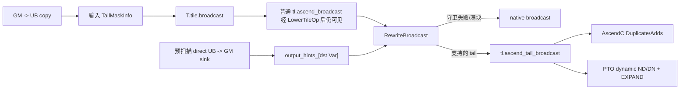

# Broadcast 场景：Shape-Changing 二维尾块传播与双后端实现

> 本文只讲二维 broadcast。基础尾块机制见本机模板
> `/mnt/workspace/tilelang-ascend/docs/tail.md`；packed predicate
> 的生产与消费分别见 [`compare`](../tail_compare/README.md) 和
> [`select`](../tail_select/README.md)。

# 1. 背景与本批范围

## 1.1 为什么 broadcast 不是简单继承输入 mask

#1360 中 unary 操作通常满足：

```text
dst.shape == src.shape
dst.valid_rect = src.valid_rect
```

broadcast 则会改变 shape。当前两类数学语义是：

```text
axis=1: [M,1] -> [M,N], dst[r,c] = src[r,0]
axis=0: [1,N] -> [M,N], dst[r,c] = src[0,c]
```

如果只把输入状态原样赋给输出，会出现：

```text
axis=1 输入 valid_col=1，却错误认为输出也只有 1 列有效；
axis=0 输入 valid_row=1，却错误认为输出也只有 1 行有效。
```

而直接把扩展轴设成完整物理长度也不总是正确。以 `N=69, block_N=64` 的最后一个 block 为例，
axis=1 虽然把一列扩成多列，但目标 GM 实际只剩 5 列，输出有效列应是 5 而不是 64。

因此 broadcast 需要同时知道：

1. 输入未扩展轴上的有效长度；
2. 输出目标逻辑矩形，尤其扩展轴在尾块中的有效长度；
3. 输入和输出各自的物理 shape/pitch。

## 1.2 本批支持范围

| 维度 | 支持内容 |
| --- | --- |
| 后端 | AscendC、PTO |
| dtype | fp16、fp32 |
| rank | lowering 后明确的 2D |
| axis=1 | `[M,1] -> [M,N]` |
| axis=0 | `[1,N] -> [M,N]` |
| scalar->2D | 不支持 |
| no-op same-shape | 不进入 tail helper |
| 开关 | 复用 `TL_ASCEND_TAIL_MASK` |

broadcast 没有 compare/select 的单 vector 宽度限制，因为它不生成或消费 packed predicate；但仍
要求规则二维 access extent、支持 dtype、有效表达式作用域安全和真实 singleton 源轴。

# 2. 数学语义：必须用公式区分两个 axis

“row broadcast”“column broadcast”在不同库里容易指代源方向或目标方向，本文以 axis 和公式为准。

## 2.1 axis=1：横向扩展 `[M,1] -> [M,N]`

```text
src physical shape = [src_rows, 1]
dst physical shape = [dst_rows, dst_cols]
dst[r,c] = src[r,0]
```

未扩展的是 row 轴，所以输入 row tail 必须传到输出：

```text
out.valid_row <= src.valid_row
```

扩展的是 col 轴。没有目标提示时，默认：

```text
out.valid_col = dst_cols
```

有 UB->GM 目标提示时：

```text
out.valid_col = sink.valid_col
out.valid_row = min(sink.valid_row, src.valid_row)
```

PTO 对应指令名是 `TROWEXPAND`：每个源行的单元素扩展成目标行。

## 2.2 axis=0：纵向扩展 `[1,N] -> [M,N]`

```text
src physical shape = [1, src_cols]
dst physical shape = [dst_rows, dst_cols]
dst[r,c] = src[0,c]
```

未扩展的是 col 轴，所以输入 column tail 必须传到输出：

```text
out.valid_col <= src.valid_col
```

没有目标提示时：

```text
out.valid_row = dst_rows
```

有目标提示时：

```text
out.valid_row = sink.valid_row
out.valid_col = min(sink.valid_col, src.valid_col)
```

PTO 对应 `TCOLEXPAND`：同一源行向多个目标行扩展。

## 2.3 测试实例

```text
M=5, N=69, block_M=4, block_N=64
```

目标物理 tile 始终是 `[4,64]`。对最后一个二维 block `bx=1, by=1`：

```text
sink.valid_row = min(4, 5 - 1*4)  = 1
sink.valid_col = min(64,69 - 1*64)= 5
```

axis=1：

```text
src physical = [4,1]
src valid    = [1,1]
out valid    = [1,5]
```

axis=0：

```text
src physical = [1,64]
src valid    = [1,5]
out valid    = [1,5]
```

两条路径最终产生相同目标有效矩形，但信息来源不同：axis=1 的 row 来自 source、col 主要来自
sink；axis=0 的 col 来自 source、row 主要来自 sink。

# 3. 与 #1360 共用的编译框架



复用点包括：

- 同一个 `TailMaskInfo` 与 UB Var 状态表；
- GM->UB copy seed；
- `LowerTileOp` 后运行 propagation；
- 同一个 opt-in 开关；
- full tile 不改写；
- 内部 opaque op、operation config、双后端 codegen 与测试分层。

但 broadcast 新增了一种 #1360 原始单向前向传播不能解决的信息：目标扩展轴的 logical tail。为此
pass 在正式前向改写前做一次 direct sink 预扫描。

# 4. 前端语法、shape 归一化与普通 ABI

前端函数位于 `tilelang/language/ascend_tile.py::broadcast`。

## 4.1 axis=1 写法

```python
src_ub = T.alloc_ub((block_M, 1), dtype)
dst_ub = T.alloc_ub((block_M, block_N), dtype)
T.tile.broadcast(dst_ub, src_ub, axis=1)
```

## 4.2 axis=0 写法

```python
src_ub = T.alloc_ub((1, block_N), dtype)
dst_ub = T.alloc_ub((block_M, block_N), dtype)
T.tile.broadcast(dst_ub, src_ub, axis=0)
```

## 4.3 1D 输入如何归一到 2D

前端允许 1D src 配合 2D dst，并根据 axis 转换：

```text
axis=0: [N] -> [1,N]
axis=1: [M] -> [M,1]
```

但当前 tail rewrite 最终只接受 lowering 后 shape 明确为二维、且一个源轴真实等于 1 的调用。
“前端能归一化 1D”不等于“本批有独立 1D tail helper”。

## 4.4 shape 校验

前端要求 broadcast 轴上的源长度为 1，非 broadcast 轴与 dst 相等：

```text
axis=1: src_rows == dst_rows, src_cols == 1
axis=0: src_rows == 1,        src_cols == dst_cols
```

普通内部 ABI在 tmp 注入后为：

```text
tl.ascend_broadcast(
  name,      // 0: Broadcast<dtype,dim,axis,false>
  dst,       // 1
  src,       // 2
  tmp,       // 3
  dim,       // 4
  dst_rows,  // 5
  dst_cols,  // 6
  src_rows,  // 7
  src_cols   // 8
)
```

AscendC 和 PTO 普通 broadcast 都在 index 3 注入 tmp。AscendC 普通 Broadcast helper 可能需要较大
workspace；PTO 当前保留 1-byte 兼容 tmp，使普通 codegen 参数结构稳定。tail broadcast 的两端
实现本身都不使用这块 tmp 做数值计算，但内部 ABI继续保留它，避免破坏前序 pass 协议。

# 5. 输出 hint：从 direct UB->GM sink 获取目标尾块

## 5.1 为什么需要预扫描

正常前向传播顺序是：

```text
copy input -> broadcast -> copy output
```

当 visit 到 broadcast 时，后面的 output copy 还没处理。如果只看 source：

- axis=1 不知道目标 col 尾长；
- axis=0 不知道目标 row 尾长。

所以 `Substitute` 先执行：

```cpp
m.CollectOutputHints(f->body);
f->body = m.VisitStmt(f->body);
```

第一次是只读全树扫描，第二次才是按执行顺序传播与改写。

## 5.2 `CollectOutputHints` 做什么

它通过 `PostOrderVisit` 找到 helper 名含 `copy_ub_to_gm` 的 `call_extern`，读取：

```text
src UB Var
valid_row
valid_col
physical_row
physical_col
```

再保存：

```cpp
output_hints_[src_v] = MakeCopyMask(...);
```

这里的 key 是 store 的 source UB，也就是 broadcast 的 dst buffer。只有 hint 的 physical shape 与
broadcast dst shape 相同，`RewriteBroadcast` 才采用，防止把另一个 slice/store 的矩形误配进来。

## 5.3 这是局部提示，不是通用逆向数据流

必须明确当前边界：

- 只识别直接 `broadcast dst UB -> GM`；
- 如果 broadcast 后先写另一个 UB、做 unary/binary，再 store，预扫描不会沿任意图反向传播；
- 同一个 UB Var 存在多个 sink 时，map 赋值没有显式求交/合并，后扫描到的条目可能覆盖前者；
- hint 不改变 source state，只补充目标 logical rectangle。

因此 output hint 是首批针对直接输出模式的受限数据流补充，不应描述成已经实现完整 backward
shape inference。

# 6. `RewriteBroadcast` 逐步算法

实现位于 `src/transform/ascend_tail_mask_propagation.cc`。

## 6.1 基础解析

读取：

```cpp
dst_v = GetPtrVar(call->args[1]);
in = GetMask(GetPtrVar(call->args[2]));
dim = call->args[4].as<IntImmNode>();
```

要求 dst 可映射到明确 UB Var、输入状态有定义的 valid row/col、`dim` 是编译期常量 2，且普通
call 至少有 9 个参数。

## 6.2 输入状态必须与声明 shape 一致

```text
in.physical_row == src_rows
in.physical_col == src_cols
```

比较使用 `arith::Analyzer::CanProveEqual`，所以支持语义等价的符号表达式，不只比较 AST 字面。

同时验证 access pointer extent：

```text
dst_extent == dst_rows * dst_cols
src_extent == src_rows * src_cols
```

这排除了非完整 slice、三维 flatten 后不能用当前二维 pitch 解释的访问，以及 shape metadata 与
access 范围不一致的调用。

## 6.3 合成输出矩形

先构造满矩形：

```cpp
TailMaskInfo out = MakeFullMask(dst_rows, dst_cols);
```

如果存在 shape 匹配 hint，就用 hint 替换它。然后判断 singleton 源轴：

axis=1 条件：

```cpp
is_one(src_cols)
```

更新：

```text
out.valid_row = hint ? min(hint.valid_row, in.valid_row) : in.valid_row
out.valid_col = hint ? hint.valid_col                    : dst_cols
```

axis=0 条件：

```cpp
is_one(src_rows)
```

更新：

```text
out.valid_row = hint ? hint.valid_row                    : dst_rows
out.valid_col = hint ? min(hint.valid_col, in.valid_col) : in.valid_col
```

最后重新判断：

```cpp
out.kind = IsStaticallyFull(...) ? kFull : kTail;
```

full tile 保持 native，而不是为了统一 source marker 强行走 tail helper。

## 6.4 axis 推断的 `[1,1]` 歧义

当前 pass 与两个 tail codegen 都根据 source singleton shape 推断 axis，且先判断 `src_cols==1`。
如果 source 恰好是 `[1,1]`，两种条件都成立，当前会优先解释成 axis=1，即使前端 `name` 字符串
表示 axis=0。

正常测试使用 `[4,1]` 或 `[1,64]`，没有歧义；但 scalar `[1,1] -> [M,N]` 本来就不在首批
范围。后续若要支持，内部 ABI 应显式携带 axis，而不是继续从 shape 反推。

## 6.5 完整守卫

| 守卫 | 原因 |
| --- | --- |
| dst 是明确 Var | 状态表需要稳定 key |
| 输入 valid row/col 已定义 | 必须有 source tail 语义 |
| dim 为常量 2 | 当前 helper 地址公式是二维 |
| src state physical shape 与 ABI shape 相等 | 防止错误 pitch |
| src/dst extent 等于 shape 面积 | 排除不规则 slice |
| `src_cols==1` 或 `src_rows==1` | 只接受真正单轴扩展 |
| 输出确实为 tail | full tile 保持 native |
| src/dst dtype 相同且为 fp16/fp32 | 只实例化已验证模板 |
| 输入/输出 valid expr 作用域安全 | 防止引用退出 loop var |

任一失败都会把 dst state 清为默认状态并保留普通 broadcast。

# 7. 内部 13 参数 ABI

tail broadcast 保留普通 0..8 参数，并追加 4 个 runtime valid extent：

```text
tl.ascend_tail_broadcast(
  name,          // 0，保留普通模板字符串
  dst,           // 1
  src,           // 2
  tmp,           // 3
  dim,           // 4，当前必须为 2
  dst_rows,      // 5
  dst_cols,      // 6
  src_rows,      // 7
  src_cols,      // 8
  out_valid_row, // 9
  out_valid_col, // 10
  src_valid_row, // 11
  src_valid_col  // 12
)
```

为什么同时携带输入和输出 valid shape：

- source valid shape 决定哪些源值真实存在；
- output valid shape 决定哪些目标 lane 应写；
- broadcast 的扩展使二者不再相同，不能像 unary 那样只传一份矩形。

当前 tail codegen 不解析 `name` 中的 axis，而是用 `src_cols==1` 推断。保留 name/tmp/dim 是为了
与普通 ABI 连续、operation config 稳定以及后续扩展，不代表设备 helper 消费全部 13 个字段。

# 8. Operation config 与 pipeline 语义

内部 `tl.ascend_tail_broadcast` 注册为 opaque op，同时在 operation config 声明：

```text
dst -> write
src -> read
tmp -> read
pipe -> PIPE_V
```

虽然当前 tail helper 数值上不读 tmp，保留该 read 关系与普通 broadcast ABI 一致，也避免前序
注入出来的 UB buffer 在后续规划中变成完全未知参数。

`PIPE_V` 表示计算位于 vector pipeline。axis=1 的 `GetValue` 与 vector `Duplicate` 之间还需要
显式 barrier，AscendC helper 内部负责处理。

# 9. AscendC 实现

## 9.1 Codegen 参数缩减

13 参数内部 op 被翻译为设备 helper：

```cpp
tl::ascend::tail_broadcast<T>(
    dst,
    src,
    axis,
    outValidRow,
    outValidCol,
    srcValidRow,
    srcValidCol,
    dstPhysCol,
    srcPhysCol);
```

行数的物理值不必传给地址公式；循环只遍历 runtime valid row，行偏移由 physical col 决定。

## 9.2 axis=1：`GetValue + Duplicate`

算法：

```cpp
uint32_t rows = min(validRow, srcValidRow);
PipeBarrier<PIPE_ALL>();
for (uint32_t r = 0; r < rows; ++r) {
  T scalar = src.GetValue(r * srcPhysCol);
  AscendC::Duplicate(
      dst[r * dstPhysCol],
      scalar,
      validCol);
}
```

逐句解释：

- `min` 防止 output hint 与 source row tail 任一侧更短时越界；
- `GetValue` 从每个源行取第 0 列；
- `r * srcPhysCol` 使用 source 物理 pitch，即使当前 shape 为 `[M,1]` 也不把 pitch 假定写死；
- `Duplicate` 把 scalar 写入目标行前 `validCol` 个元素；
- `r * dstPhysCol` 保留目标每行 gap；
- barrier 协调此前 vector copy 与 scalar `GetValue`。

无效列 `[validCol,dstPhysCol)` 不写；无效行 `[rows,dstRows)` 也不写。

## 9.3 axis=0：`Adds(..., 0)` 复制源行

算法：

```cpp
uint32_t cols = min(validCol, srcValidCol);
for (uint32_t r = 0; r < validRow; ++r) {
  AscendC::Adds(
      dst[r * dstPhysCol],
      src,
      static_cast<T>(0),
      cols);
}
```

数学上：

```text
dst_row = src_row + 0
```

这利用已稳定的 vector Adds 连续 count 接口复制源行的有效前缀。每个目标行都从同一个 `src`
起点读，正好实现 `dst[r,c]=src[0,c]`。

为什么不直接调用普通 AscendC Broadcast runtime shape API：该 API 只接收逻辑 shape，不携带独立
物理行 pitch。当 `valid_col < physical_col` 时，若按紧凑 `[validRow,validCol]` 解释，第二行地址
会落到上一物理行 gap。逐行 `Duplicate/Adds` 明确使用 pitch，正确性更可控。

## 9.4 与 #1360 helper 策略的区别

#1360 unary/binary/scalar 的典型策略是 full、contiguous count、mask+repeat、per-row fallback。
broadcast 不是对相同 shape 做逐 lane 函数，而是复制一个 singleton 轴，因此直接使用定制逐行算法：

- axis=1：每行读取不同 scalar，再 Duplicate；
- axis=0：反复读取同一源行，再 Adds 0。

不能把它描述成复用了 #1360 的 `BuildUnaryRepeatPlan`。

# 10. PTO 实现

## 10.1 目标统一使用 dynamic ND view

目标生成：

```cpp
TileUbDataND<T, dstRows, dstCols,
             pto::DYNAMIC, pto::DYNAMIC>
    dst_temp(outValidRow, outValidCol);
TASSIGN(dst_temp, dst_base + dst_offset * sizeof(T));
```

静态物理 shape 保留 UB pitch，动态构造参数限制实际计算矩形。`TASSIGN` 只是视图绑定，不复制
数据。

## 10.2 axis=1 源使用 DN view

生成形态：

```cpp
TileUbDataDN<T,
             srcCols,
             srcRows,
             pto::DYNAMIC,
             1>
    src_temp(srcValidRow);
TASSIGN(src_temp, src_address);
TROWEXPAND(dst_temp, src_temp);
```

DN 是对同一 UB 地址的布局视图解释，不是先做一次物理 transpose。`TROWEXPAND` 期望每个逻辑
row 对应一个可扩展 scalar，DN view 用模板参数顺序满足该指令的布局契约。

## 10.3 axis=0 源使用 ND view

```cpp
TileUbDataND<T,
             srcRows,
             srcCols,
             1,
             pto::DYNAMIC>
    src_temp(srcValidCol);
TASSIGN(src_temp, src_address);
TCOLEXPAND(dst_temp, src_temp);
```

有效 row 固定 1，有效 col 运行时传入。`TCOLEXPAND` 把这一行扩展到 dst 的动态有效行数。

## 10.4 为什么 PTO 没新增 common broadcast helper

PTO 已有 `TROWEXPAND/TCOLEXPAND`，而 Dynamic Tile 能直接表达输入/输出有效 shape。codegen 只需
生成正确 ND/DN 类型和地址绑定，所以没有像 AscendC 那样在 `src/tl_templates/pto/common.h`
新增循环 helper。

# 11. 与 #1360 的主要区别

| 对比项 | #1360 unary/binary/scalar | 本次 broadcast |
| --- | --- | --- |
| physical shape | 通常输入输出相同 | 输入输出必然不同 |
| mask 传播 | 继承或求交即可 | 必须按 axis 合成新矩形 |
| 信息方向 | 前向 source state 足够 | 扩展轴需要 direct output sink hint |
| 内部 ABI | 一份 valid rect + data pitch | 输入/输出两份 valid rect + 两份物理 shape |
| AscendC | mask/repeat 可表达相同 shape elementwise | 定制逐行 Duplicate/Adds |
| PTO | ND dynamic data Tile | dst ND；axis1 src DN；axis0 src ND |
| full tile | native | 同样 native |
| fallback state | 清 dst | 同样清 dst，但 native broadcast 仍受既有 pad/shape 约束 |

#1360 建立的是“尾块 metadata 随数据向前走”的主干；broadcast 第一次要求 metadata 在 shape-changing
节点处重新构造，并通过一个受限的后向目标提示补足扩展轴信息。

# 12. 与 compare、select 的区别

| 场景 | 输出 kind | 是否 packed | 物理 shape 是否变化 | 特有信息 |
| --- | --- | --- | --- | --- |
| compare | `kPackedCmp` | 是 | 数据 shape 映射为 mask byte layout | `storage_col`、尾 bit 清零 |
| select | `kTail` | 输入 mask 是 | 数据 shape通常不变 | predicate provenance、PTO tmp |
| broadcast | `kTail` | 否 | 是 | axis、src/out 两份 shape、output hint |

broadcast 输出是普通 data state，可以自然流向 #1360 的 unary/binary/scalar 或 #1421 reduce；compare
输出只能进入理解 packed predicate 的 consumer；select 则把 packed 控制重新汇入普通数据流。

# 13. Fallback 边界

以下场景保留普通 broadcast 并清 dst tail state：

- flag 关闭；
- full tile；
- 输入没有 tracked valid shape；
- 非 2D；
- src state 与调用 shape 不一致；
- access extent 不是 shape 面积；
- 没有 singleton 源轴；
- scalar `[1,1] -> [M,N]`；
- dtype 不是 fp16/fp32或 src/dst dtype 不同；
- valid expr 作用域不安全；
- 输出矩形最终不是 tail。

需要区分两种说法：

- 已确认：这些场景不会生成新的 `tl.ascend_tail_broadcast`；
- 不能泛化：native fallback 在所有任意 tail/layout 上都天然精确。

native 路径仍按既有 physical tile、pad/store clamp 和后端 Broadcast 实现工作。若某个新场景本身
超出 native 能力，应独立定义 API/tiling 约束，而不是依赖 tail pass 的 fallback 隐式解决。

# 14. 测试设计与验证边界

## 14.1 Host source/lowering

参数矩阵：

```text
2 backend × 2 dtype × 2 axis = 8 组合
```

断言：

- AscendC 出现 `tl::ascend::tail_broadcast`；
- PTO 出现 `pto::DYNAMIC`；
- axis=1 出现 `TROWEXPAND`；
- axis=0 出现 `TCOLEXPAND`。

## 14.2 NPU runtime 测试代码

两类 kernel 都使用：

```text
M=5, N=69, block_M=4, block_N=64
```

axis=1 golden 按每个 `by` 把 `a[:,by]` 扩展到对应列区间；axis=0 golden 按每个 `bx` 把
`a[bx,:]` 扩展到对应行区间。fp16/fp32、AscendC/PTO 均使用 exact equality，因为 broadcast 只
复制值，没有算术舍入。

## 14.3 当前未覆盖项

- broadcast 专属 full-tile/flag-off source 断言；
- bf16/int/uint fallback；
- 1D、same-shape no-op、`[1,1]` 歧义；
- 没有 direct output hint 的数值行为；
- broadcast 后经过中间 consumer 再 store；
- 同 UB 多 sink hint 合流；
- broadcast 专属 Expert mode；
- 更复杂 BufferRegion/slice。

当前 primary 已完成静态检查、8 个 broadcast `LowerAndLegalize` 组合和 helper 编译验证；当前环境
没有执行这些 NPU runtime 用例。完整 source-codegen pytest 还受到现有构建产物 UB 地址预分配
问题影响，因此文档不把测试代码存在等同于真机已验收。

# 15. 一个完整轴向推导实例

## 15.1 axis=1

```text
input state:  [validRow=1, validCol=1] in [4,1]
sink hint:    [validRow=1, validCol=5] in [4,64]
```

推导：

```text
src_cols == 1 -> axis1
out.valid_row = min(1,1) = 1
out.valid_col = 5
```

AscendC：读取 `src[0]`，Duplicate 5 个元素。PTO：构造 DN source `(srcValidRow=1)`，目标
dynamic ND `(1,5)`，执行 TROWEXPAND。

## 15.2 axis=0

```text
input state:  [validRow=1, validCol=5] in [1,64]
sink hint:    [validRow=1, validCol=5] in [4,64]
```

推导：

```text
src_rows == 1 -> axis0
out.valid_row = 1
out.valid_col = min(5,5) = 5
```

AscendC：对目标有效的 1 行执行 `Adds(src,0,count=5)`。PTO：source dynamic ND `(1,5)`，目标
dynamic ND `(1,5)`，执行 TCOLEXPAND。

# 16. 后续演进建议

1. 把 axis 作为 tail ABI 显式参数，消除 `[1,1]` 的 shape 推断歧义。
2. 将 output hint 从 direct-sink map 升级成有合流规则的数据流分析，至少支持 UB->UB 与简单
   shape-preserving consumer。
3. 对同一 UB 多 sink 定义交集、相等或拒绝策略，不能依赖遍历覆盖顺序。
4. 为非规则 slice 引入显式 row stride metadata，再扩展 AscendC helper。
5. 增加 full/off/fallback/无 hint/Expert/NPU 性能测试。
6. 真机评估 AscendC axis0 的逐行 Adds 与潜在 repeat copy、axis1 的 scalar GetValue barrier 成本。
7. 若未来支持 scalar `[1,1] -> [M,N]`，应单独定义语义与后端映射，而不是让 axis 优先级隐式决定。
