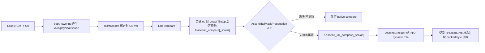

# Compare 场景：二维尾块比较与 Packed Predicate 传播

> 本文只讲 `compare`，并说明它如何接入 #1360 建立的尾块有效区传播框架。
> `select` 和 `broadcast` 的尾块改写不在本次提交范围内。

# 1. 背景、问题与本批目标

## 1.1 为什么普通 compare 在尾块上不够

TileLang 前端按照固定物理块分配 UB，例如：

```python
block_M = 4
block_N = 64
a_ub = T.alloc_ub((block_M, block_N), "float")
mask_ub = T.alloc_ub((block_M, block_N // 8), "uint8")
```

当全局矩阵宽度 `N=69` 时，前两个逻辑块分别覆盖：

```text
by = 0: [0, 64)   -> valid_col = 64，满块
by = 1: [64, 69)  -> valid_col = 5，尾块
```

UB 仍然按照 `[4, 64]` 分配。尾块中每一行只有前 5 个数据有效，其余 59 个位置不是当前
逻辑矩阵的一部分。普通 compare 接收的 `count` 却是物理元素数 `4 * 64`，因此会比较无效
位置，并在 predicate buffer 中留下没有业务含义的 bit。

对普通 elementwise 输出，这些无效结果通常不会被 `UB -> GM` 回写；但 compare 的输出会被
`select` 当成控制信息再次消费。控制信息一旦带入脏 bit，就不再只是“无效数据算多了”，而可能
直接决定后续有效 lane 选哪个输入。因此 compare 必须显式知道逻辑有效矩形。

## 1.2 本批支持范围

本批 compare 支持：

| 维度 | 支持内容 |
| --- | --- |
| 后端 | AscendC、PTO |
| 数据类型 | `float16`、`float32`（TileLang 中 `"float16"`、`"float"`） |
| 右操作数 | tensor、立即数 scalar |
| 比较模式 | `EQ/NE/GT/GE/LT/LE`，沿用普通 compare 模式字符串 |
| 输入布局 | clean 2D rectangle tail，两个 tensor 的物理 shape 必须一致 |
| predicate | `uint8` packed mask，每 8 个逻辑比较结果占 1 byte |
| 开关 | 只使用既有 `TL_ASCEND_TAIL_MASK` |

保守宽度约束为：

```text
physical_col <= 256 / sizeof(T)
physical_col % 8 == 0
```

所以当前单行最大物理列数是：

```text
float16: 256 / 2 = 128
float32: 256 / 4 = 64
```

这里的 `256` 是一轮 vector 数据宽度（字节）。首批实现限定为单 vector repeat，是为了让
AscendC packed predicate 的每行起点、结果字节布局和 PTO 路径保持可证明的一致性。超过范围
不会强行改写，而是保留既有 native compare 路径。所有受检失败分支都会清除传播状态；
`BufferLoad` scalar 等未支持形式也不会留下过期的 packed mask 状态，详见第 11 节。

# 2. compare 的数学语义与 packed 存储

## 2.1 tensor/tensor 和 tensor/scalar

设输入有效矩形是：

```text
R = [0, valid_row) × [0, valid_col)
```

tensor/tensor 的逻辑结果为：

```text
P[r, c] = Compare(src0[r, c], src1[r, c], mode), (r, c) ∈ R
```

tensor/scalar 的逻辑结果为：

```text
P[r, c] = Compare(src[r, c], scalar, mode), (r, c) ∈ R
```

两个 tensor 可能分别带有尾块状态。真正允许计算的范围取交集：

```text
valid_row = min(lhs.valid_row, rhs.valid_row)
valid_col = min(lhs.valid_col, rhs.valid_col)
```

这与 #1360 的 binary elementwise 交集规则一致；区别是 compare 的输出不再是与输入同 dtype、
同物理列数的普通数据，而是 packed predicate。

## 2.2 packed predicate 的位布局

逻辑列 `c` 映射到：

```text
byte_index = c // 8
bit_index  = c % 8
```

第 `r` 行的物理地址是：

```text
mask_address(r, c) = r * storage_col + c // 8
```

对应 byte 中使用低位优先：

```text
mask[r * storage_col + c // 8] 的第 (c % 8) 位
```

例如一行 10 个比较结果：

```text
c = 0..7  -> byte 0 的 bit 0..7
c = 8..9  -> byte 1 的 bit 0..1
```

因此逻辑有效 predicate 字节数为：

```text
packed_valid_col = ceil(valid_col / 8)
                 = (valid_col + 7) // 8
```

物理 predicate 每行至少需要：

```text
packed_physical_min = ceil(physical_col / 8)
```

但代码不能把物理行距简单写死成 `physical_col / 8`。UB flatten、对齐和 access pointer 的 extent
可能使 mask 每行实际占用更多 byte，所以状态中单独保存 `storage_col`。

## 2.3 为什么最后一个 byte 必须清零高位

当 `valid_col % 8 != 0` 时，最后一个 byte 只有低 `valid_col % 8` 位有效。保留掩码是：

```cpp
uint8_t keep = (1U << (validCol & 7U)) - 1U;
```

语法逐项解释：

- `7U` 是无符号整数 7；`validCol & 7U` 等价于非负整数的 `validCol % 8`。
- `1U << k` 生成只有第 `k` 位为 1 的值。
- 再减 1，得到低 `k` 位全部为 1 的掩码。
- `old_byte & keep` 保留有效低位并把无效高位置 0。

例如 `valid_col=5`：

```text
valid_col & 7 = 5
keep = (1 << 5) - 1 = 0b00011111 = 0x1f
```

这条清零规则非常重要：即便下游 select 理论上只访问有效 5 列，predicate 作为可观察输出写回
GM 时也必须具有确定语义；测试会逐 byte 对比，不能让 bit 5..7 保留硬件未定义结果。

当前承诺只覆盖“最后一个部分有效 byte 的无效高 bit”。实现不会把
`[ceil(valid_col/8), storage_col)` 的其余整 byte padding 全部清零，也不会清无效行；这些区域由
dynamic mask width 和尾块 store clamp 排除，不属于逻辑输出。

# 3. 与 #1360 共用的整体框架

compare 没有另建一套尾块系统，而是接入 #1360 建立的同一条链路：



关键共性是：

1. 前端 API 不增加 tail 参数。
2. `T.copy` 负责识别真实有效范围。
3. pass 在 `LowerTileOp` 之后运行，因为此时高层 tile op 已经变成稳定的内部 `tl.ascend_*` 调用。
4. 满块不改写，保持原生成代码。
5. feature flag 仍是 `tl.ascend_tail_mask`，Python 名称为
   `tilelang.PassConfigKey.TL_ASCEND_TAIL_MASK`。
6. 不支持场景走 native fallback，而不是猜测硬件行为。

编译顺序在 `tilelang/engine/phase.py` 中是：

```python
mod = tilelang.transform.LowerTileOp()(mod)
mod = tilelang.transform.AscendTailMaskPropagation(...)(mod)
```

如果顺序反过来，pass 看不到 `tl.ascend_compare`，也就无法按普通 op 的 ABI 识别输入、输出、
模式和 count。

# 4. 数据结构：从普通 Tail 到 PackedCmp

核心结构位于 `src/transform/common/ascend_tail_mask.h`：

```cpp
enum class TailMaskKind {
  kFull = 0,
  kTail = 1,
  kPackedCmp = 2,
};

struct TailMaskInfo {
  TailMaskKind kind = TailMaskKind::kFull;
  PrimExpr valid_row;
  PrimExpr valid_col;
  PrimExpr physical_row;
  PrimExpr physical_col;
  PrimExpr storage_col;
};
```

## 4.1 每个字段的含义

| 字段 | compare 中的含义 |
| --- | --- |
| `kind` | 输入通常为 `kTail`；compare 成功后输出为 `kPackedCmp` |
| `valid_row` | 逻辑有效数据行数，同时也是有效 predicate 行数 |
| `valid_col` | 逻辑数据列数，不是 byte 数 |
| `physical_row` | 输入数据 tile 的物理行数 |
| `physical_col` | 输入数据 tile 的物理列数/数据行距 |
| `storage_col` | packed mask 每行实际占用的 byte 数 |

`PrimExpr` 是 TVM 的符号表达式类型，不要求值在编译时就是常量。尾块的有效列数通常是：

```text
Select(N - by * block_N >= block_N,
       block_N,
       Select(N - by * block_N > 0, N - by * block_N, 0))
```

所以不能使用普通 C++ `int` 保存它。`arith::Analyzer` 用来证明两个 `PrimExpr` 相等、某个表达式
小于上界，或者 extent 是否等于物理矩形面积。

## 4.2 为什么状态表使用 `const VarNode *`

pass 内部维护：

```cpp
std::unordered_map<const VarNode *, TailMaskInfo> state_;
```

`VarNode` 是 UB buffer 的底层 data Var。使用节点指针作为 key，表示按 IR 对象身份关联状态，
不会因为两个 buffer 名字相似而混淆。`GetPtrVar` 会从 `tvm_access_ptr` 中取出 `args[1]` 的
data Var，从而把 `a_ub.access_ptr(...)` 还原成状态表中的 `a_ub` 身份。

## 4.3 `MakePackedCmpMask`

```cpp
inline TailMaskInfo MakePackedCmpMask(const TailMaskInfo &data,
                                      PrimExpr storage_col) {
  TailMaskInfo m = data;
  m.kind = TailMaskKind::kPackedCmp;
  m.storage_col = storage_col;
  return m;
}
```

这里刻意保留 `valid_col` 为“逻辑元素列数”，没有把它改成 byte 数，因为 bit 清理和后续消费者
都需要逻辑 lane 数，而不是 predicate byte 数。只有 PTO 创建 mask Tile view 时，才临时计算
`(valid_col + 7) / 8`。

# 5. 前端语法与普通内部 op

## 5.1 Python DSL 写法

tensor/tensor：

```python
T.tile.compare(mask_ub, a_ub, b_ub, "LT")
```

tensor/scalar immediate：

```python
T.tile.compare(mask_ub, a_ub, 0.0, "LT")
```

六种 mode 与数学关系对应如下：

| mode | 关系 |
| --- | --- |
| `EQ` | `src0 == src1` |
| `NE` | `src0 != src1` |
| `GT` | `src0 > src1` |
| `GE` | `src0 >= src1` |
| `LT` | `src0 < src1` |
| `LE` | `src0 <= src1` |

前端函数位于 `tilelang/language/ascend_tile.py::compare`。它根据 `src1` 类型分派：

- `Buffer/BufferRegion` -> `tl.ascend_compare`
- `PrimExpr/float` -> `tl.ascend_compare_scalar`
- `BufferLoad` 也走 scalar 普通 op，但它还携带 buffer pointer 和 index

本批 tail compare 只接受“立即数 scalar”。`BufferLoad` 需要运行时 `GetValue(index)` 和同步，
其普通 ABI 参数数量也不同，因此守卫要求普通 call 恰好有 5 个参数，并检查 `args[2]` 不是
pointer；BufferLoad 形式保留 native。

## 5.2 普通 op ABI

tensor/tensor：

```text
tl.ascend_compare(
  dst_mask_ptr,  // 0
  src0_ptr,      // 1
  src1_ptr,      // 2
  mode,          // 3: StringImm
  count          // 4: physical_row * physical_col
)
```

立即数 scalar：

```text
tl.ascend_compare_scalar(
  dst_mask_ptr,  // 0
  src_ptr,       // 1
  scalar,        // 2
  mode,          // 3
  count          // 4
)
```

`StringImm` 表示 mode 是 IR 中的编译期字符串节点。后续 codegen 使用 `Downcast<StringImm>`
读取值，并映射成 `AscendC::CMPMODE::LT` 或 `CmpMode::LT`。

# 6. Pass：`RewriteCompare` 逐步解析

实现位于 `src/transform/ascend_tail_mask_propagation.cc`。

## 6.1 选择 tensor 或 scalar 分支

```cpp
if (call->op.same_as(ascend_compare()))
  return RewriteCompare(call, false);
if (call->op.same_as(ascend_compare_scalar()))
  return RewriteCompare(call, true);
```

`op.same_as(...)` 比较的是 TVM Op 对象身份，不依赖字符串拼写。第二个布尔参数只描述右操作数
是否为 scalar，两个分支最终共享一套有效区与 packed 状态逻辑。

## 6.2 计算 tensor 输入交集

```cpp
TailMaskInfo lhs = GetMask(GetPtrVar(call->args[1]));
TailMaskInfo data = lhs;
if (!scalar) {
  TailMaskInfo rhs = GetMask(GetPtrVar(call->args[2]));
  data = IntersectMasks(lhs, rhs, analyzer_);
  if (!SamePhysicalShape(lhs, rhs)) fallback;
}
```

`IntersectMasks` 取有效行列的逐维 `Min`。但 compare helper 的一份 `physCol` 同时用于 src0 和
src1 行偏移，所以两个 tensor 的 `physical_row/physical_col` 必须可以被 analyzer 证明相等。
否则即使有效区交集能算出来，地址公式也不成立。

## 6.3 推导 `storage_col`

```cpp
PrimExpr extent = PtrExtent(dst_ptr);
storage_col = extent / data.physical_row;
```

`PtrExtent` 读取 `tvm_access_ptr` 的 `args[3]`。随后验证：

```text
dst_extent == physical_row * storage_col
storage_col >= ceil(physical_col / 8)
```

第一条保证目标 access 是完整二维行布局，第二条保证每行容得下全部物理 predicate bit。

## 6.4 完整守卫

| 守卫 | 原因 |
| --- | --- |
| call 参数数等于 5 | 排除 BufferLoad scalar 等不同 ABI |
| `CleanTail(count, data)` | 必须是真正尾块，且 count 等于二维物理面积 |
| dtype 为 fp16/fp32 | 只实例化已验证硬件模板 |
| tensor 输入 dtype 相同 | 避免隐式混合类型比较 |
| dst dtype 为 uint8 | packed predicate 的物理载体 |
| tensor/tensor 物理 shape 相同 | 共用逐行地址公式 |
| `physical_col <= 256/bytes` | 单 vector repeat 契约 |
| `physical_col % 8 == 0` | 物理数据行能整 byte 打包 |
| `storage_col` 可定义且足够大 | 防止行间 predicate 覆盖 |
| mode 是 `StringImm` | codegen 需要编译期枚举名 |
| valid 表达式未引用已退出 loop var | 防止生成未定义变量 |
| 不是旧的 broadcast-scalar 特殊 mask | 避免把复制的单 scalar 错当成普通矩形 |

对进入主要守卫后发生的失败，关键动作不只是“返回原语句”，还包括：

```cpp
state_[dst_v] = TailMaskInfo{};
```

默认构造的 `TailMaskInfo` 是未跟踪的 `kFull` 状态。这样后续消费者不会误以为 native compare
生成的是本框架已经证明过布局的 packed mask。函数先解析 `dst_v`，再检查 ABI 参数个数：

```cpp
const VarNode *dst_v =
    call->args.empty() ? nullptr : GetPtrVar(call->args[0]);
if (call->args.size() != 5) {
  if (dst_v != nullptr)
    state_[dst_v] = TailMaskInfo{};
  return Stmt();
}
```

因此 7 参数 `BufferLoad` scalar 虽然仍保留 native 路径，但会先清理同一 mask UB 可能残留的旧
`kPackedCmp` 状态，避免 buffer 复用时留下过期来源信息。

## 6.5 tail compare 内部 ABI

成功后构造：

```text
tl.ascend_tail_compare[_scalar](
  dst,           // 0, uint8 packed mask
  src0,          // 1
  src1/scalar,   // 2
  mode,          // 3
  valid_row,     // 4
  valid_col,     // 5，逻辑元素列数
  physical_row,  // 6
  physical_col,  // 7，数据行距
  storage_col    // 8，mask byte 行距
)
```

C++ 中使用：

```cpp
Array<PrimExpr> a = {...};
return Evaluate(Call(DataType::Handle(), ascend_tail_compare(), a));
```

- `Array<PrimExpr>` 是 TVM 可持久化 IR 数组。
- `Call(DataType::Handle(), op, a)` 创建返回类型为 handle 的内部调用表达式。
- TIR 语句不能裸放一个表达式，所以外层用 `Evaluate(...)` 包装成 statement。

注册在 `src/op/ascend.cc` 中使用 `set_num_inputs(-1)`。这里 `-1` 表示 Op 注册层接受可变参数；
真正的固定 9 参数契约由 pass 和 codegen 的 `ICHECK_EQ(op->args.size(), 9U)` 双重约束。

# 7. AscendC 实现

## 7.1 Codegen 只做类型与语法翻译

`TailCompareOpCodegen` 从 src0 access pointer 取得 dtype，并生成：

```cpp
tl::ascend::tail_compare<float>(
    mask, src0, src1, AscendC::CMPMODE::LT,
    valid_row, valid_col, physical_col, storage_col);
```

scalar 版本会显式生成 `half(expr)` 或 `float(expr)`，避免 Python 的 `0.0` 默认 dtype 与输入
模板类型不一致。

注意内部 ABI 带 `physical_row`，当前 helper 不需要它，因为循环上界是 `valid_row`，行偏移只
需要 `physical_col`。保留它是为了状态语义完整，也给后续扩展多 repeat 或布局校验留下信息。

## 7.2 tensor/tensor helper

核心循环：

```cpp
for (uint32_t r = 0; r < validRow; ++r) {
  AscendC::Compare(
      dst[r * storageCol],
      src0[r * physCol],
      src1[r * physCol],
      mode,
      static_cast<uint64_t>(validCol),
      1,
      rp);
}
```

每个表达式的意义：

- `dst[r * storageCol]`：`LocalTensor::operator[]` 返回从该 byte offset 开始的子 tensor。
- `src[r * physCol]`：跳过完整物理行，而不是跳过 `validCol`；这避免第二行落到第一行 gap 中。
- `static_cast<uint64_t>(validCol)`：Level-0 API 的连续 mask/count 类型。
- `1`：每次只做一个 repeat。
- `rp`：`AscendC::BinaryRepeatParams`，block stride 设 1，repeat stride 设 0；跨行由外层 C++ 循环
  明确移动地址，不让硬件接口猜 predicate 行距。

## 7.3 scalar helper

scalar 使用 `AscendC::Compares` 和 `UnaryRepeatParams`：

```cpp
AscendC::Compares(dst_row, src_row, scalar, mode, validCol, 1, rp);
```

这里的 “Unary” 指只有一个 tensor 输入，不代表 compare 是数学上的一元运算。标量通过寄存器/立即
值参与每个 lane 的比较。

## 7.4 为什么不用 #1360 的跨行 mask + repeat

#1360 的普通 unary/binary/scalar 输出与输入具有同一元素宽度，`physical_col` 可以转换成
repeat stride。compare 的输出却压缩成 1 bit/lane，而且当前 AscendC Compare/Select Level-0
接口没有独立的 predicate row stride 可以同时准确表达数据行距与 packed mask 行距。

因此首版选择“每行一个 repeat”：

- 算法更直接；
- 数据地址和 mask 地址分别使用自己的 pitch；
- 不依赖跨行 packed 输出的隐含布局；
- 代价是多行 tail 会产生一个运行时行循环，后续需要真机评估性能。

## 7.5 清理最后一个 byte

Compare 指令完成后先：

```cpp
AscendC::PipeBarrier<PIPE_ALL>();
```

这是因为随后要用 scalar `GetValue/SetValue` 读改写刚由 vector pipe 产生的 predicate byte。没有
barrier，标量访问可能观察到尚未完成的结果。清理后再做一次 barrier，保证后续回写或消费者
不会早于清理操作观察 mask。

# 8. PTO 实现

## 8.1 Dynamic Tile 的概念

PTO Tile 类型同时携带物理 shape 和有效 shape：

```cpp
TileUbDataND<T,
             PhysicalRows,
             PhysicalCols,
             ValidRows,
             ValidCols>
```

`pto::DYNAMIC` 表示有效维度在运行时通过构造参数传入，而物理行列仍是编译期模板参数。生成函数
`CreateUbVariableDynamic(info, valid_row, valid_col)` 会输出：

```cpp
TileUbDataND<float, 4, 64, pto::DYNAMIC, pto::DYNAMIC>
    src_temp(valid_row, valid_col);
TASSIGN(src_temp, base + offset * sizeof(float));
```

`TASSIGN` 把 Tile view 绑定到原 UB 地址，没有复制数据。

## 8.2 数据 Tile 与 mask Tile 使用不同有效列

数据 view：

```text
src valid shape = [valid_row, valid_col]
```

mask view：

```text
mask valid shape = [valid_row, ceil(valid_col / 8)]
```

`GetCompareMaskInfo` 从 BufferShapeCollector 保存的 4D PTO shape
`[M, N, Valid_M, Valid_N]` 中恢复 mask 的物理 row/col，并保留真实 UB 地址和 slice offset。
这一步不能用 src ShapeInfo 直接替代，因为 src 的列单位是数据元素，mask 的列单位是 byte。

## 8.3 PTO 指令映射

tensor/tensor：

```cpp
tl::ascend_pto::compare(dst_mask, src0, src1, CmpMode::LT);
```

tensor/scalar：

```cpp
tl::ascend_pto::compare_scalar(dst_mask, src, scalar, CmpMode::LT);
```

helper 内部分别调用 `pto::TCMP` 和 `pto::TCMPS`。对某些 PTO mask Tile 类型，代码通过
`reinterpret_cast` 把 `int8_t` view 解释成 `uint8_t` view；这里不改变地址和 bit，只解决 PTO
模板签名对 mask element type 的要求。

## 8.4 PTO 的尾 bit 清理

PTO compare 后同样调用：

```cpp
tl::ascend_pto::clear_compare_tail_bits(
    dst, valid_row, logical_valid_col);
```

循环地址仍是：

```cpp
dst.data()[r * Cols + last]
```

其中 `Cols` 是 mask Tile 的物理 byte 列数，而 `last = logical_valid_col >> 3`。清理前后使用
`TL_PIPE_V_BARRIER()`，语义与 AscendC 的 PIPE barrier 相同。

# 9. 与 #1360 的主要区别

| 对比项 | #1360 unary/binary/scalar | 本次 compare |
| --- | --- | --- |
| 输出数据形态 | 与输入同 dtype、同矩形布局 | `uint8` packed predicate |
| 状态 kind | `kTail` | `kPackedCmp` |
| `valid_col` 单位 | 数据元素 | 仍是逻辑数据元素 |
| 新增 pitch | 通常 `storage_col=physical_col` | `storage_col` 是 mask byte 行距 |
| 有效输出列 | `valid_col` | `ceil(valid_col/8)` byte |
| 输入合流 | binary 取矩形交集 | tensor compare 同样取交集，并额外要求物理 shape 一致 |
| AscendC 主要算法 | 可用 mask + repeat 跨多行 | 每行单 repeat，分别处理数据 pitch 和 predicate pitch |
| PTO | 数据 dynamic Tile | 数据 dynamic Tile + packed-mask dynamic Tile |
| 尾部规范化 | 普通数据无额外 bit | 最后 byte 的无效高 bit 必须清零 |
| 下游状态 | 可继续给普通 elementwise/reduce | 记录为 `kPackedCmp`，供回写和未来受跟踪消费者使用 |

本质上，#1360 解决的是“同一类二维数据怎样只计算有效矩形”；compare 新增的是“怎样把二维数据
有效矩形安全地转换成另一种压缩存储语义，并让后续 pass 知道这种来源”。

# 10. 与后续 select、broadcast 场景的区别

| 场景 | 状态变化 | 核心难点 |
| --- | --- | --- |
| compare | `kTail -> kPackedCmp` | bit packing、byte pitch、最后 byte 清零 |
| select | `kPackedCmp + kTail -> kTail` | predicate 来源验证、两种 src1 ABI、数据区交集 |
| broadcast | 输入/输出均为普通数据，但 physical shape 改变 | 扩展轴有效长度推导、目标 sink hint、ND/DN 布局 |

compare 是生产控制 mask 的“编码器”；select 是消费 mask 的“解码与数据合流”；broadcast 不产生
控制 mask，它改变的是 shape 和同一输入值的复制关系。后两类场景需要独立实现和验证，不属于
本次 compare-only 提交。

# 11. Fallback 与正确性边界

以下情况不进入 tail compare：

- feature flag 关闭；
- full tile；
- 非 fp16/fp32；
- tensor/tensor 物理 shape 不一致；
- scalar 来自 BufferLoad，而不是立即数；
- mask 不是 uint8；
- mask extent 不能解释为规则二维 byte pitch；
- mask 每行空间不足；
- `physical_col` 超过单 vector 宽度或不是 8 的倍数；
- count 不是完整二维物理面积；
- valid expression 引用了已退出作用域的循环变量。

设计原则是“保留 native”与“继续传播 packed 状态”不能同时发生。所有守卫失败（包括 7 参数
`BufferLoad` scalar）都会清掉 dst state，避免后续流程观察到过期的 `kPackedCmp` 来源信息。

# 12. 测试设计与如何阅读结果

## 12.1 Host codegen 测试

`testing/python/language/test_tilelang_ascend_language_tail_mask_codegen.py` 覆盖：

- 2 backend × 2 dtype × 2 compare 类型 × 6 compare mode；
- `M=5, N=69, block_M=4, block_N=64`，最后一块 `valid_col=5`；
- AscendC source marker：`tail_compare` / `tail_compare_scalar`；
- PTO source marker：`pto::DYNAMIC`、`compare` / `compare_scalar`、
  `clear_compare_tail_bits`；
- full tile 保留 native；
- flag off 保留 native；
- fp32 `block_N=128` 的超宽场景回退。

## 12.2 设备数值测试

`pack_compare_lt` 是 CPU golden：

```python
for bit in range(8):
    packed |= bits[:, :, bit] << bit
```

这与硬件布局的 `bit_index = c % 8` 完全一致。测试把 `mask_ub` 回写 GM，与 golden 逐 byte、
`rtol=0, atol=0` 对比，因此能检测最后一个 byte 高位没有清零的问题。

设备用例覆盖 tensor/tensor 和 tensor/scalar、fp16/fp32、双后端。

# 13. 一个完整尾块实例

设：

```text
M=5, N=69, block_M=4, block_N=64, dtype=float32
bx=1, by=1
```

则：

```text
valid_row = min(4, 5 - 1*4)   = 1
valid_col = min(64, 69 - 1*64)= 5
physical shape = [4, 64]
mask logical valid bytes/row = ceil(5/8) = 1
mask physical minimum bytes/row = 64/8 = 8
keep = 0x1f
```

执行步骤：

1. GM->UB copy 把 `a_ub` 标为 `[1,5] in [4,64]` 的 `kTail`。
2. `RewriteCompare` 验证 fp32 最大物理列正好为 64。
3. mask access extent 除以 4 得到 `storage_col`。
4. pass 生成 `tl.ascend_tail_compare`，并把 `mask_ub` 标为 `kPackedCmp`。
5. AscendC 只执行 `r=0` 的一行 Compare；PTO 构造 `[1,5]` data dynamic Tile 和 `[1,1]`
   mask dynamic Tile。
6. 最后 predicate byte 与 `0x1f` 做 AND，bit 5..7 确定为 0。
7. 尾块 store 只把有效 packed byte 回写 GM，测试逐 byte 验证结果。

# 14. 当前限制与后续扩展点

1. 多 vector repeat 的 compare 还未开放；需要验证跨 repeat packed 输出的 byte 起点和行距。
2. BufferLoad scalar 仍走 native；fallback 会清理旧 `kPackedCmp` 状态。若要真正支持 tail，
   内部 ABI 还需要携带 scalar buffer、index 和必要 barrier。
3. 当前只覆盖规则二维矩形，不覆盖任意稀疏 mask、非连续 layout 或三维 predicate。
4. `storage_col` 目前由 access extent/physical_row 推导；未来若出现显式 stride buffer，应把 stride
   作为一等 shape metadata，而不是继续从 extent 反推。
5. AscendC 逐行循环与 PTO dynamic Tile 的性能仍需在真实 NPU 上按有效行数和 block shape 评估。

这些限制通过守卫和 fallback 表达。不应通过放宽 `ICHECK` 或删除状态清理来绕过；扩展范围前
应先补状态语义和对应回归测试。
