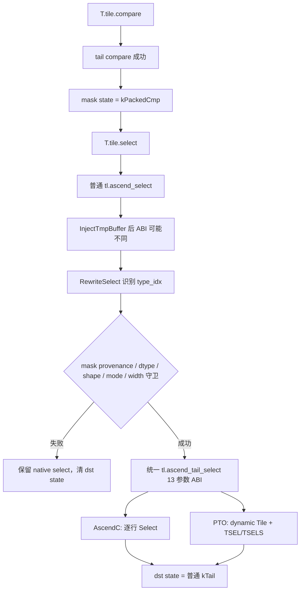

# Select 场景：Tracked Packed Predicate 驱动的二维尾块选择

> 本文只讲 `select`。它不是一个可以独立理解的普通 elementwise：当前 tail select 的 mask 必须来自
> 已被尾块 pass 成功跟踪的 compare。compare 的 bit 布局见
> [`tail_compare/README.md`](../tail_compare/README.md)，shape-changing broadcast 见
> [`tail_broadcast/README.md`](../tail_broadcast/README.md)，基础框架见本机模板
> `/mnt/workspace/tilelang-ascend/docs/tail.md`。

# 1. 背景与核心问题

## 1.1 select 的数学语义

tensor/tensor 模式：

```text
dst[r,c] = predicate[r,c] ? src0[r,c] : src1[r,c]
```

tensor/scalar 模式：

```text
dst[r,c] = predicate[r,c] ? src0[r,c] : scalar
```

在尾块上，只有：

```text
(r,c) ∈ [0, valid_row) × [0, valid_col)
```

属于当前逻辑矩阵。select 既要避免读取无效数据，也要避免读取 predicate 最后一个 byte 中的无效
高位，更不能把一个布局来源不明的普通 `uint8` buffer 当成 compare predicate。

## 1.2 为什么 select 比 #1360 的 binary 更复杂

看起来 tensor/tensor select 与 binary op 都有两个数据输入，但它们的状态合流不同：

```text
binary: src0 data rect + src1 data rect -> dst data rect
select: packed predicate + src0 data rect + [src1 data rect] -> dst data rect
```

predicate 的每一 bit 决定一个数据元素，因此它同时具有两套单位：

- 逻辑单位：`valid_col` 个数据元素；
- 存储单位：每行 `storage_col` 个 byte。

此外，AscendC 与 PTO 的普通 select ABI 不一致：PTO 在编译早期自动插入 tmp buffer，AscendC
没有这个参数。tail pass 必须先识别两种 ABI，再规范化成一个内部 13 参数协议。

## 1.3 本批支持范围

| 维度 | 支持内容 |
| --- | --- |
| 后端 | AscendC、PTO |
| dtype | fp16、fp32 |
| predicate | 当前 pass 跟踪到的 `kPackedCmp` |
| src1 | immediate scalar（type=1）或 tensor（type=2） |
| mode | scalar 对应 `VSEL_TENSOR_SCALAR_MODE`；tensor 对应 `VSEL_TENSOR_TENSOR_MODE` |
| shape | clean 2D rectangle tail |
| width | 与 compare 共用单 vector 约束 |
| feature flag | `TL_ASCEND_TAIL_MASK` |

不支持：

- `BufferLoad`/type=0；
- `VSEL_CMPMASK_SPR`；
- 从 GM 复制进来的任意 uint8 mask；
- 非 fp16/fp32；
- 宽度超过首批 compare/select 合约。

# 2. 端到端编译流程



这里存在两个不同时间点：

1. `InjectTmpBuffer` 在 `LowerAndLegalize` 开头运行；
2. `LowerTileOp` 后紧接 `AscendTailMaskPropagation`。

因此 tail pass 看到的 select 已经带有后端相关 tmp 形态。这也是代码不能假定 `args[3]` 永远是
`src1_type` 的原因。

# 3. 前端语法与三种普通 select 形式

前端位于 `tilelang/language/ascend_tile.py::select`。

## 3.1 tensor/tensor（tail 支持）

```python
T.tile.select(
    out_ub,
    mask_ub,
    a_ub,
    b_ub,
    "VSEL_TENSOR_TENSOR_MODE",
)
```

前端普通 ABI：

```text
dst, mask, src0, type=2, src1_ptr, mode, count
```

共 7 个参数。

## 3.2 tensor/scalar（tail 支持）

```python
T.tile.select(
    out_ub,
    mask_ub,
    a_ub,
    1.0,
    "VSEL_TENSOR_SCALAR_MODE",
)
```

普通 ABI：

```text
dst, mask, src0, type=1, scalar, mode, count, src0_dtype, mask_dtype
```

共 9 个参数。最后两个字符串供普通 AscendC codegen 选择模板类型，tail pass 规范化后不再需要把
它们带进内部 ABI，因为 dtype 可以从 access pointer 恢复。

## 3.3 BufferLoad/type=0（tail 不支持）

普通 ABI 还允许 `src1` 是某个 buffer 的单元素 load。它会携带 pointer、index、mode、count，
并可能使用 `VSEL_CMPMASK_SPR`。该路径涉及从 UB 取标量和额外同步，本批没有改写。

因此“前端支持三种 select”不等于“tail select 支持三种 select”。文档、测试和 codegen 都必须
明确区分普通 API 能力与本批 allow-list。

# 4. Predicate provenance：为什么只接受 `kPackedCmp`

## 4.1 provenance 不只是 dtype

一个 `uint8` buffer 可能表示：

- 普通量化数据；
- 字节数组；
- 从 GM 读入的任意用户 mask；
- compare 产生的 bit-packed predicate。

只看 dtype 无法区分这四种语义。`RewriteSelect` 首先读取：

```cpp
TailMaskInfo packed = GetMask(GetPtrVar(call->args[1]));
```

然后要求：

```cpp
packed.is_packed_cmp()
```

`kPackedCmp` 只由成功的 `RewriteCompare` 通过 `MakePackedCmpMask` 产生。普通 GM->UB copy 只会产生
`kTail`；所以外部 uint8 mask 即使内存中恰好使用相同 bit 布局，也不能自动进入 tail select。

这是一个编译期类型细化：

```text
uint8 Buffer                 -> 只说明物理元素类型
TailMaskKind::kPackedCmp     -> 额外证明逻辑列、物理数据 shape、byte pitch 和生产者来源
```

## 4.2 UB->UB copy 可以继承 provenance

基础 pass 对 `copy_ub_to_ub` 执行：

```cpp
state_[dst_v] = GetMask(src_v);
```

所以一个已跟踪 compare mask 在 UB 内部做等价复制后仍可保持 `kPackedCmp`。这是状态传播，而不是
重新根据 uint8 内容猜测语义。

## 4.3 compare 负责规范化，select 负责消费

最后 predicate byte 的无效高 bit 由 compare helper 清零。select 不再重复清理，只按
`valid_col` 消费。这样的职责划分保证：

- compare 的 packed 输出本身就是确定的；
- 多个 select 可以复用同一 mask；
- select helper 不需要读改写 predicate；
- 测试可以把 mask 直接写回 GM 做精确比较。

# 5. 数据有效区合流算法

## 5.1 `IntersectDataMask`

pass 以 packed predicate 保存的逻辑数据矩形为基准：

```cpp
TailMaskInfo out = packed;
out.kind = TailMaskKind::kTail;
out.storage_col = out.physical_col;
```

这里把 kind 从 `kPackedCmp` 改回 `kTail`，因为 select 输出重新是普通 fp16/fp32 数据。
`storage_col` 也恢复成数据的物理列距。

随后与 data operand 逐维求交：

```text
out.valid_row = min(packed.valid_row, data.valid_row)
out.valid_col = min(packed.valid_col, data.valid_col)
```

如果 analyzer 能证明两者相等，就直接保留原表达式，避免生成多余 `Min`。

## 5.2 scalar 模式

```text
out_rect = intersect(packed logical rect, src0 rect)
```

scalar 在所有逻辑位置都可用，不携带二维 data mask；因此不再参与交集。但代码必须确认
`src1` 不是 access pointer，避免把 buffer 地址误当成标量值。

## 5.3 tensor 模式

```text
out_rect = intersect(packed logical rect, src0 rect, src1 rect)
```

在加入 src1 前还要求 `SamePhysicalShape(out, src1)`。当前 helper 只携带一份 `physCol`，用它为
dst、src0、src1 计算每行偏移；物理 shape 不一致时这份地址公式不能同时成立。

需要准确理解当前检查边界：pass 对 tensor src1 做了显式物理 shape 比对；src0/dst 的完整一致性
还依赖前端 `dst_shape == src0_shape`、access extent 和 `CleanTail`。不能把实现描述成“pass 独立
证明了所有四个 buffer 的任意 stride 完全相等”。

# 6. AscendC/PTO 普通 ABI 差异与识别方法

## 6.1 为什么 PTO 多一个 tmp

`src/transform/common/operation_config.h` 有两张 tmp 参数表：

- `ascendc_tmp_arg_ops` 中没有 select；
- `pto_tmp_arg_ops` 为 select 指定 index 3。

`InjectTmpBuffer` 会在 index 3 插入 `tmp_ub.access_ptr(...)`。所以：

```text
AscendC: dst, mask, src0, type, src1, mode, count, ...
PTO:     dst, mask, src0, tmp, type, src1, mode, count, ...
```

PTO tmp 大小按：

```text
dst element count * dst dtype bytes
```

取所有需要 tmp 的 op 的最大值，并分配在 UB。tail select 继续复用这块已注入的固定 tmp；动态化的
只是有效 data Tile view，不是 tmp buffer 的物理分配。

## 6.2 `type_idx` 的语法

pass 使用：

```cpp
int type_idx = call->args[3].as<IntImmNode>() != nullptr ? 3 : 4;
```

解释：

- AscendC `args[3]` 是 `IntImm(1/2)`，所以 `type_idx=3`；
- PTO `args[3]` 是 tmp access pointer（`CallNode`），所以 `type_idx=4`。

随后统一计算：

```cpp
src1_idx = type_idx + 1;
mode_idx = type_idx + 2;
size_idx = type_idx + 3;
```

这种写法没有直接读取 target 字符串，而是根据已经存在的 IR 结构判断，更适合 pass 在同一份 C++
代码里处理两种后端。但它也意味着新增第三种 ABI 时必须重新审查判别条件，不能只在 tmp 表中加
一项就认为 pass 会自动兼容。

# 7. `RewriteSelect` 的完整守卫

## 7.1 类型与 mode

只接受：

```text
type=1 + VSEL_TENSOR_SCALAR_MODE
type=2 + VSEL_TENSOR_TENSOR_MODE
```

pass 不接受 mode/type 交叉组合。例如 type=1 却带 tensor mode，会保留 native。

数据 dtype 条件：

```text
dst dtype == src0 dtype
tensor 模式: src1 dtype == dst dtype
dtype ∈ {float16, float32}
mask dtype == uint8
```

## 7.2 shape、count 与宽度

`CleanTail(count, out)` 要求：

```text
out.kind == kTail
count == out.physical_row * out.physical_col
```

共用 compare 的保守宽度：

```text
physical_col <= 256 / dtype.bytes()
physical_col % 8 == 0
```

注意限制的是 `physical_col`，不是最后一个块运行时的 `valid_col`。即使尾块只剩 5 列，但物理
block_N=128 的 fp32 tile 仍超过当前单 repeat 合约，会整体 fallback。

## 7.3 作用域安全

`valid_row/valid_col` 可能引用 block loop var。pass 跟踪：

```cpp
all_loop_vars_
active_loop_vars_
```

如果状态在一个循环内由 copy 产生，select 却被调度到循环外，直接把旧 loop var 打进生成代码会
产生未声明标识符。`HasOutOfScopeLoopVar` 在这种情况下拒绝改写。

## 7.4 成功与失败状态

成功：

```cpp
state_[dst_v] = out;  // 普通 kTail data rect
```

失败：

```cpp
state_[dst_v] = TailMaskInfo{};
```

清理输出状态是为了阻止后续 op 继承一份没有经过 tail select 证明的矩形。原 `tl.ascend_select`
语句本身保留，由既有 native codegen 处理。

# 8. 内部 13 参数 ABI

pass 成功后统一生成：

```text
tl.ascend_tail_select(
  kind,         // 0: "Scalar" 或 "Tensor"
  dst,          // 1
  mask,         // 2: tracked packed mask
  src0,         // 3
  tmp,          // 4: PTO 真 tmp；AscendC 为占位 pointer
  src1_type,    // 5: 1 或 2
  src1,         // 6: scalar 或 tensor pointer
  mode,         // 7
  valid_row,    // 8
  valid_col,    // 9，逻辑数据列
  physical_row, // 10
  physical_col, // 11，数据 pitch
  storage_col   // 12，packed mask byte pitch
)
```

AscendC 没有 select tmp。为了让后续两个 codegen 使用同一参数位置，pass 把 mask pointer 放到 tmp
占位槽：

```cpp
PrimExpr tmp = type_idx == 4 ? call->args[3] : call->args[1];
```

这不是说 AscendC helper 会把 mask 当 tmp 使用；它只保证 `args[4]` 总是一个合法 access pointer，
方便统一 operation config 和 PTO codegen 解包。

13 参数是“pass -> codegen 的统一 ABI”，不是“AscendC 与 PTO 设备 API 完全相同”：

- AscendC 消费 mode、valid shape、data pitch、mask pitch，不消费 tmp；
- PTO 消费 kind、dynamic shape、tmp，设备指令 `TSEL/TSELS` 不直接接收字符串 mode；
- `physical_row/physical_col/storage_col` 在 PTO 中主要通过 ShapeInfo 的静态模板信息体现。

# 9. Operation config 为什么也要修改

内部 op 注册为 opaque 只解决“IR 中可以存在该调用”，pipeline planning、sync insert 和 memory
planning 还需要知道每个参数的读写方向：

```text
dst  -> write
mask -> read
src0 -> read
tmp  -> read
src1 -> read
pipe -> PIPE_V
```

配置位于 `src/transform/common/operation_config.h`。如果漏掉这一步，后续 pass 可能无法建立正确
依赖，尤其 PTO tmp 与 predicate/data 的读后写顺序会失去统一描述。

scalar 模式下 `src1` 是立即数，不是真实 buffer；operation config 的静态位置描述仍保留统一 ABI，
具体 pass 在解析 access pointer 时必须允许该位置不是 CallNode。

# 10. AscendC 实现

## 10.1 Codegen 生成的调用

tensor：

```cpp
tl::ascend::tail_select<float>(
    dst, mask, src0, src1,
    AscendC::SELMODE::VSEL_TENSOR_TENSOR_MODE,
    validRow, validCol, physCol, storageCol);
```

scalar：

```cpp
tl::ascend::tail_select_scalar<half>(
    dst, mask, src0, half(scalar),
    AscendC::SELMODE::VSEL_TENSOR_SCALAR_MODE,
    validRow, validCol, physCol, storageCol);
```

`kind` 字符串决定选择哪个 C++ helper。`src1_type` 已经在 pass 中验证，codegen 不再重复使用它
分派。

## 10.2 为什么必须逐行

核心算法：

```cpp
for (uint32_t r = 0; r < validRow; ++r) {
  AscendC::Select(
      dst[r * physCol],
      selMask[r * storageCol],
      src0[r * physCol],
      src1[r * physCol], // scalar 版本这里是 scalar
      mode,
      static_cast<uint64_t>(validCol),
      1,
      rp);
}
```

地址单位分别是：

```text
data row offset = r * physCol 个 T
mask row offset = r * storageCol 个 uint8
```

`AscendC::BinaryRepeatParams` 描述 dst/src 数据的 block/repeat stride，但没有独立的 selMask row
stride。若直接跨 `validRow` 做多 repeat，无法同时表达 data pitch 与 packed predicate pitch。
所以与 compare 一样，每行一个 repeat，外层循环分别移动两种地址。

## 10.3 scalar 为什么仍使用 BinaryRepeatParams

AscendC Select 的 Level-0 API 形态仍沿用 binary repeat 参数结构，即使第四个数据输入是 scalar。
这里的 “Binary” 是接口参数族名称，不表示 scalar 版本会读取第二个 tensor。

select 不需要像 compare 那样清 predicate byte：compare 已经清理，select 只读。执行范围又被
`validCol` 限制，因此不会把同 byte 的高位扩展成有效输出。

# 11. PTO 实现

## 11.1 创建 dynamic views

PTO 为同一 UB 地址创建：

```text
dst  valid = [valid_row, valid_col]
src0 valid = [valid_row, valid_col]
src1 valid = [valid_row, valid_col]  // tensor 模式
mask valid = [valid_row, ceil(valid_col/8)]
```

物理 `row/col` 仍来自静态 ShapeInfo。`CreateUbVariableDynamic` 只创建 view 并 `TASSIGN`，不会
分配或复制第二份 UB 数据。

PTO 的 `GetCompareMaskInfo` 要求 mask buffer shape 已被 BufferShapeCollector 表达为静态 4D
`[M,N,Valid_M,Valid_N]`。它从中恢复 mask 的物理 byte pitch，并结合 src0 slice 推导有效
predicate byte 数。

## 11.2 tensor 模式：`TSEL`

```cpp
TSEL(dst, mask, src0, src1, tmp);
```

PTO 模板要求 dst/src0/src1 是完全兼容的 Tile 类型。让三者都使用相同的动态有效行列，正是为了
满足这项静态模板约束，同时让硬件只处理逻辑有效矩形。

## 11.3 scalar 模式：`TSELS`

```cpp
TSELS(dst, mask, src0, tmp, scalar);
```

注意 tmp 和 scalar 的参数顺序与 `TSEL` 不同。codegen 不能通过简单拼接一个可选参数来共用
调用，而是必须有两个明确分支。若 scalar 的 TIR dtype 与 src0 不同，会生成显式 C++ 类型转换。

## 11.4 PTO 为什么仍受 AscendC 宽度限制

PTO dynamic Tile 在技术上可能表达更宽有效区，但本批使用一套共享 propagation allow-list。为了
保证双后端对同一个 TileLang kernel 的 rewrite/fallback 决策一致，PTO 也受：

```text
physical_col <= 256 / sizeof(T)
physical_col % 8 == 0
```

后续如果要单独开放 PTO 宽场景，应先定义后端能力矩阵和一致的测试预期，而不是直接删除共享
守卫。

# 12. 与 #1360 的主要区别

| 对比项 | #1360 普通 tail elementwise | 本次 select |
| --- | --- | --- |
| 可独立改写 | 输入有普通 tail state 即可 | 必须依赖上游 tracked compare |
| 输入状态 | 1～2 个 `kTail` | `kPackedCmp` + 1～2 个 `kTail` |
| 状态合流 | 继承或矩形交集 | predicate 逻辑矩形与 data rect 多路交集 |
| 存储单位 | 所有输入都是数据元素 | predicate 是 byte/bit，数据是 fp 元素 |
| ABI | unary 6、binary/scalar 7 参数 | 后端规范化后的 13 参数 |
| tmp | 普通 elementwise 通常无 | PTO select 预注入 tmp，AscendC 占位 |
| AscendC | 可走 contiguous/mask-repeat/逐行梯度 | 因 mask 无 row stride 固定逐行单 repeat |
| PTO | data dynamic Tile | data dynamic Tile + packed-mask Tile + fixed tmp |
| fallback 传播 | 清普通 dst state | 必须同时依赖 compare 清 provenance、select 清 dst state |

#1360 主要传播“某个 buffer 哪个二维区域是数据”；select 还传播“这个控制 buffer 是否由受信任
compare 产生，以及它的逻辑元素坐标如何映射到 byte pitch”。

# 13. 与 compare、broadcast 的区别

## 13.1 compare 是 producer，select 是 consumer

```text
compare: data -> packed control
select:  packed control + data -> data
```

compare 负责 bit packing 和尾 bit 清零；select 负责 provenance 验证、数据区域交集与选择。

## 13.2 broadcast 不需要 provenance

broadcast 输入输出都是普通 data state。它的难点是 physical shape 改变和扩展轴有效长度推导，
不是 bit/byte 单位转换。broadcast 输出可以继续进入普通 unary/binary/reduce；select 输出同样恢复
为普通 `kTail`，但它进入 tail 路径的前提比 broadcast 严格得多。

# 14. Fallback 行为与边界

以下情况保留普通 `tl.ascend_select`：

- flag 关闭或 full tile；
- mask 不是 `kPackedCmp`；
- type 不是 1/2；
- mode 与 type 不匹配；
- scalar 实际是 pointer；
- dtype 不支持或数据 dtype 不一致；
- tensor src1 物理 shape 不一致；
- count 不是二维物理面积；
- width 超过单 repeat 合约；
- valid expression 作用域不安全。

fallback 是“保持既有普通路径”，不应泛化成“所有不支持 tail 都天然数值正确”。普通 PTO select
本身只支持 type1/type2；普通 AscendC 对齐、pad 和 store clamp 也有既有约束。allow-list 的意义是
不让新的尾块 rewrite 扩大未知风险，并不替代对 native 路径的独立验证。

# 15. 测试设计与验证边界

## 15.1 Source/lowering 覆盖

host 测试覆盖：

```text
2 backend × 2 dtype × 2 compare form × 2 select form = 16 组合
```

因此 tensor compare + scalar select、scalar compare + tensor select 这两种交叉链路也会检查生成
marker。另有：

- full tile native；
- flag off native；
- fp32 block_N=128 wide fallback；
- external GM mask 不能触发 tail select。

## 15.2 NPU runtime 用例

设备测试代码覆盖：

- tensor compare + tensor select；
- scalar compare + scalar select；
- fp16/fp32；
- AscendC/PTO；
- `M=5,N=69,block=4×64` 的 row/column 双尾块；
- Developer 自动 pass 配置；
- fp32 tensor/tensor Expert `T.Scope("V")` 手工 barrier。

数值 golden 使用：

```python
condition = a < b_or_zero
ref = torch.where(condition, a, other)
```

当前设备 runtime 没有覆盖两个交叉组合，也没有覆盖 BufferLoad/type0、所有 compare mode 或宽度
边界。本文描述的是代码设计与测试覆盖，不把“测试文件存在”表述为“已经在当前环境完成真机
执行”。

# 16. 一个完整实例

设尾块状态：

```text
packed mask logical rect = [1,5] in data physical [4,64]
packed mask storage_col = 8 bytes/row（示例）
src0 rect = [1,5] in [4,64]
src1 rect = [1,5] in [4,64]
```

tensor select：

1. `type_idx` 在 AscendC 中识别为 3，在 PTO 中识别为 4。
2. `packed.is_packed_cmp()` 成立。
3. packed 与 src0、src1 的交集仍是 `[1,5]`。
4. `CleanTail` 证明普通 count 为 `4*64`。
5. pass 生成 13 参数 `tl.ascend_tail_select("Tensor",...)`。
6. AscendC 执行一行、5 lane Select，mask 行地址使用 byte pitch。
7. PTO 创建 data `[1,5]` 和 mask `[1,1 byte]` 的 dynamic views，执行 `TSEL`。
8. dst 状态成为普通 `[1,5] in [4,64]` 的 `kTail`，可以继续流向后续 unary/binary 或 UB->GM。

# 17. 后续扩展建议

1. 增加 BufferLoad/type0 tail ABI前，先明确 AscendC 取标量与 PTO 支持矩阵。
2. 若开放 `VSEL_CMPMASK_SPR`，不能只改 mode allow-list，还要定义 predicate 来源与硬件寄存器语义。
3. 为 external packed mask 提供显式的“声明逻辑 shape/pitch”接口，比按 dtype 自动信任更安全。
4. 扩宽多 repeat 前，需要分别验证 Compare 输出布局和 Select mask 跨 repeat寻址。
5. 增加 stale-state、mask UB 复用、src0/dst 非标准 slice、交叉 runtime 组合测试。
6. 真机性能测试应比较逐行 AscendC helper 与可能的分块多 repeat 方案，而不能只比较 source 行数。
