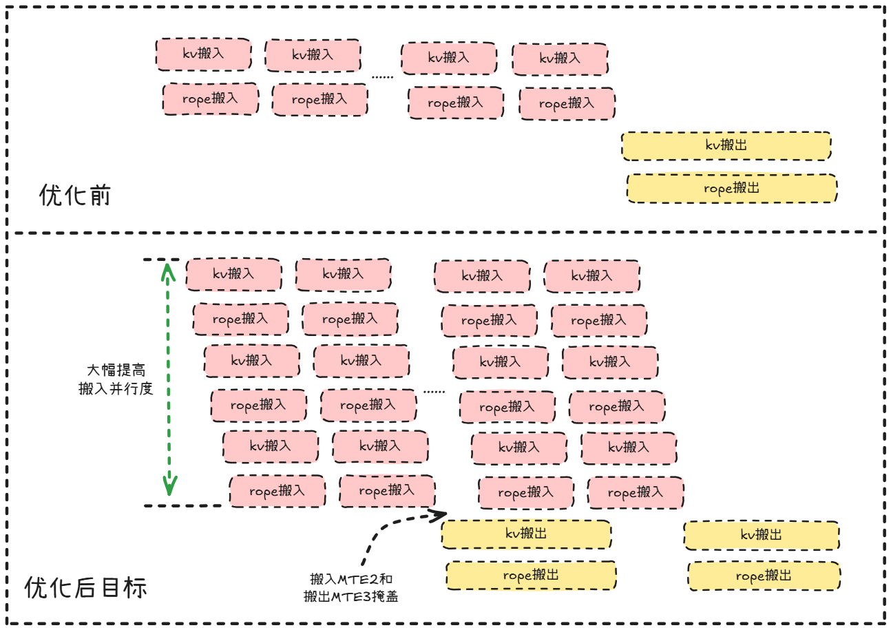
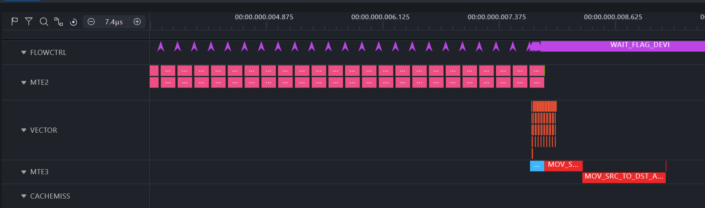
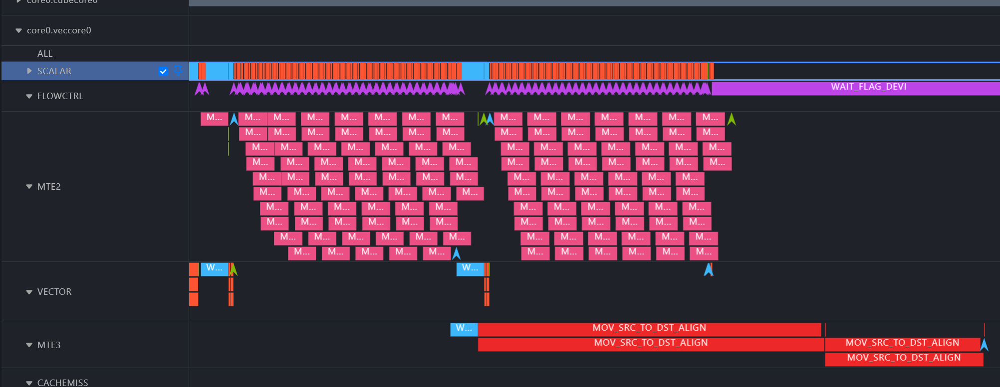
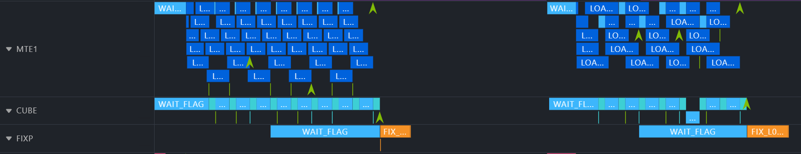
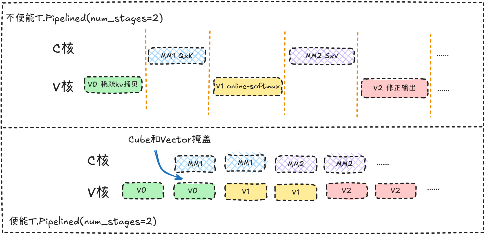
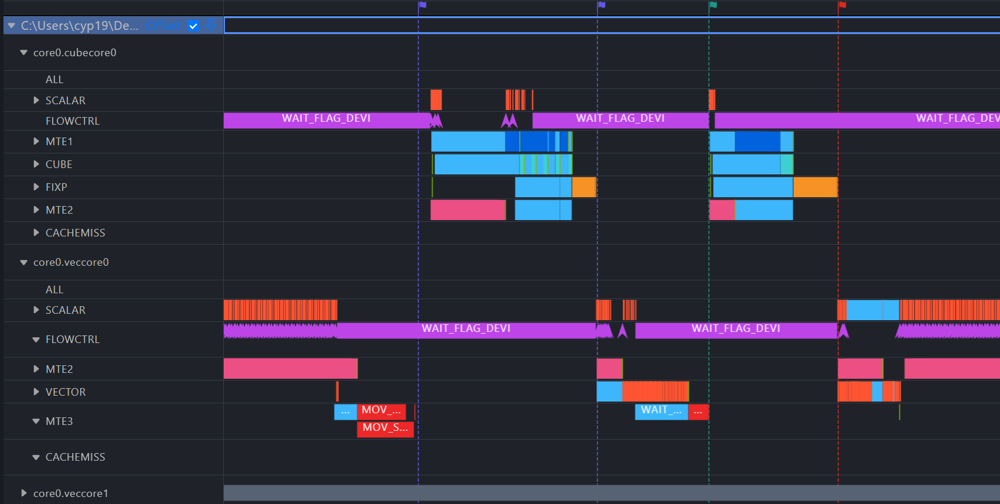
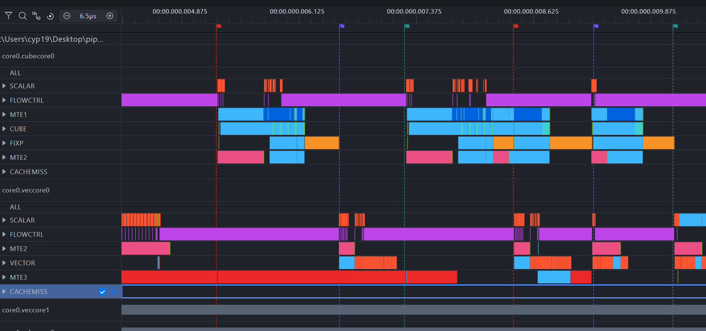

# Writing High-Performance SparseMLA Operator with TileLang-Ascend

**English** | [中文](sparse_mla_performance_optimization_zh.md)

## 1. Background

SparseMLA is the core attention mechanism introduced in DeepSeek v3.2. This article discusses the implementation and optimization of the Paged Attention version of the SparseMLA operator in TileLang-Ascend.

## 2. Test Inputs

The inputs are defined in `bench_sfa.py`, with the following common parameters:

- T=1
- B=1
- Q_N=128
- KV_N=1
- D=512
- D_rope=64
- sparse_size=2048
- block_size=128
- act_kv_s=2560

Three sets of shapes differ only in KV_S:

| No. | KV_S | Description |
| --- | ---: | --- |
| shape0 | 2560 | Short sequence |
| shape1 | 6400 | Medium sequence |
| shape2 | 48000 | Long sequence |

`act_kv_s` is fixed at 2560, and `sparse_size` is fixed at 2048. The effective sparse window size actually participating in the computation remains basically unchanged.

## 3. Performance Results

|  | shape0 | shape1 | shape2 | Average Time (us) | AscendC / TileLang |
| --- | ---: | ---: | ---: | ---: | ---: |
| AscendC  | 98.000 | 99.000 | 100.000 | 99.000 | 1.00x |
| TileLang | 109.760 | 109.100 | 108.980 | 109.280 | 0.91x |

*Note: AscendC reference implementation source:* https://gitcode.com/cann/cann-recipes-infer/blob/master/ops/ascendc/torch_ops_extension/custom_ops/converter/npu_sparse_flash_attention.py

## Fixed Core: Launch Kernel with Fixed Physical Compute Cores

In Cube-Vector fused operators, the AIC (Cube) and AIV (Vector) are independent execution units, and data interaction between them must go through Workspace variables in Global Memory. Therefore, the allocation strategy of the Workspace directly affects memory footprint and memory access performance. To address this issue, TileLang provides two ways to launch a kernel:

**Default Mode** — launch by logical task count:
```python
@T.prim_func
def tl_kernel(
    ...
    # Workspace is allocated by logical task count; block_num can be much larger than the physical core count
    workspace: T.Tensor([block_num, block_M, block_N], dtype),
):
    # ↓ alloc_buffer / annotate_address are expanded along block_num, executed once per logical task
    buf = T.alloc_L1([block_M, block_N], dtype)
    T.annotate_layout({buf: ...})

    with T.Kernel(block_num, is_npu=True) as (cid, vid):
        # Each logical task owns an independent workspace slice
        T.copy(result, workspace[cid, :, :])
```

In this mode, the compiler independently executes initialization operations such as `alloc_buffer` and `annotate_address` for each logical task and allocates a separate Workspace. When the number of logical tasks far exceeds the physical core count, three performance issues arise: **(1)** Initialization operations are redundantly executed with the task count; **(2)** Total Workspace grows linearly with the task count, causing huge memory overhead; **(3)** The inflated Workspace exceeds the L2 Cache capacity, and the intermediate tensors frequently exchanged between Cube and Vector are swapped to HBM, encountering severe memory access bottlenecks.

**Fixed Core Mode** — launch by physical core count:
```python
@T.prim_func
def tl_kernel(
    ...
    # Workspace is allocated by physical core count, fixed at 24 copies, residing in L2 as much as possible
    workspace: T.Tensor([core_num, block_M, block_N], dtype),
):
    # ↓ alloc_buffer / annotate_address are executed only once on each of the 24 physical cores
    buf = T.alloc_L1([block_M, block_N], dtype)
    T.annotate_layout({buf: ...})

    with T.Kernel(core_num, is_npu=True) as (cid, vid):
        # Manually distribute logical tasks evenly across physical cores, each core reuses the same workspace
        single_core_load = T.ceildiv(block_num, core_num)
        for block_idx in T.serial(cid * single_core_load, (cid + 1) * single_core_load):
            ...
            T.copy(result, workspace[cid, :, :])  # workspace[cid] is reused
```

By constraining computation tasks to a fixed number of physical cores via `T.Kernel(core_num, is_npu=True)`, the above issues are resolved:

- **Reduced Redundant Initialization**: Operations like `alloc_buffer` and `annotate_address` are executed only once on each of the 24 physical cores, no longer repeated with the logical task count, significantly reducing kernel launch overhead.
- **CV Relay Memory Optimization**: The Workspace required for Cube-Vector data interaction is strictly limited to `core_num` copies (24 copies) instead of `block_num` copies, fundamentally curbing memory inflation.
- **Intermediate Data Resident in L2**: The Workspace allocation keeps intermediate tensors resident in the on-chip L2 Cache as much as possible. Results written by the Cube core can be directly read by the Vector core from L2, avoiding the latency caused by swapping to HBM.


## Tiling: Split Strategy
Tiling not only determines the inter-core load balance but also directly affects overall computational efficiency and task scheduling. It mainly involves two key dimensions of split design:


### Inter-Core Splitting

Inter-core splitting determines how global computation tasks are distributed across 24 (A2, A3) physical AI Cores for parallel execution. The inter-core splitting of SparseMLA is performed along four dimensions: **batch × seq_len_q × g_block_num × kv_heads**, where `g_block_num` is further blocking of the head group dimension.

Taking the test input parameters as an example (`q_heads=128, kv_heads=1, m_base_size=16`):

- **Head group dimension blocking**: GQA group size `g = q_heads / kv_heads = 128`. Since `g > m_base_size`, the Q head dimension is split by `m_base_size=16`, yielding `g_block_num = g / m_base_size = 8` sub-blocks. Each compute core processes 16 consecutive Q head sub-blocks.


### Intra-Core Splitting

Each physical core, when executing a single logical task, further iterates in blocks along the **seq_len_kv (topk)** dimension.
`topk=2048` is split by `n_base_size=256`, yielding `n_block_num = ⌈topk / n_base_size⌉ = 8` iterations. Each iteration executes a complete round of "Gather KV → MM1(QK^T) → Softmax → MM2(PV) → Accumulate Output".

Increasing the block size of the `seq_len_kv` dimension enlarges the data scale of each round of Gather KV and Copy Out, which helps to improve memory access throughput. At the same time, enlarging the basic block size can further improve Cube-side computational efficiency.


## Sparse KV: Sparse Memory Access Optimization
In sparse scenarios, KV data is discretely distributed in Global Memory, but subsequent Cube matrix operations require continuous memory input. The following mechanism design and optimization are adopted here:

- **Dual Vector Core Memory Access Instruction Emission**: Based on the 1:2 ratio of Cube cores to Vector cores on A2/A3 chips, the Vector core is used to emit memory access instructions, doubling the instruction issuing efficiency.
- **Discrete KV Gather and Continuous Copy Out**: Uses a unified sparse index to first gather the discrete KV from GM to UB. After gathering into continuous blocks here, they are copied out in one go to the Workspace for subsequent Cube core usage.
- **Asynchronous Copying (Manual Intra-Core Synchronization)**: Manually setup operations for `set_flag` / `wait_flag` make the discrete copy-in executed asynchronously, significantly reducing the overall KV gather time.
- **Copy In and Out Ping-Pong (Double Buffer)**: A double-buffer mechanism is used for the discrete KV gather operation. While the current data is being written to the Workspace through MTE3, the MTE2 read instruction for the next block of data has already been asynchronously initiated, enabling pipeline overlap between MTE3 and MTE2.

With the coordinated operation of the multiple optimization mechanisms mentioned above, the overall design objectives and implementation ideas of this sparse KV memory access optimization are illustrated in the figure below:


The actual pipelines before and after the final optimization of this sample are shown in the following figures. By manually configuring intra-core synchronization, MTE2 load instructions can be issued continuously, which greatly improves the parallelism of MTE2. Meanwhile, the Copy-In and Copy-Out Ping-Pong realizes pipeline overlapping between MTE3 and MTE2, further reducing KV gather latency.

**Pipeline before optimization:**


**Pipeline after optimization:**



## Split-K pipelined GEMM v0 implementation: MTE1 and Cube Pipeline Overlap

In standard matrix multiplication execution, data must first be carried from L1 to L0A/L0B by MTE1 before being handed to the Cube compute unit for MMA (matrix multiply-accumulate) instruction execution. If executed in serial logic, the Cube sits completely idle while waiting for MTE1 to carry the next batch of data. The `gemm_v0` template achieves MTE1 and Cube pipeline overlap through **K-axis blocking + Ping-Pong double buffering + fine-grained synchronization**, with the following specific splits:

### Cube Intra-Core Splitting


- **K-dimension splitting of MM1 (Q×K^T)**: The K dimension of the matrix multiplication is `dim + rope_dim = 512 + 64 = 576`, split by `k_l0_size=64` into `⌈576/64⌉ = 9` sub-blocks. L0A/L0B each allocate double buffers (`q_l0a[2, 16, 64]`, `kv_l0b[2, 64, 256]`), achieving MTE1 transport and Cube computation pipeline overlap through Ping-Pong.

- **K-dimension splitting of MM2 (P×V)**: The K dimension of the matrix multiplication is `n_base_size=256`, split by `mm2_k_l0_size=32` into 8 sub-blocks. Double buffering is similarly used for pipelining.

Based on the above splits, double buffering alternately writes to L0 buffer regions via `kk % 2`, with precise synchronization using `set_flag` / `wait_flag`: while the Cube is executing the `mma` operation on the $i$-th chunk of L0 data, MTE1 simultaneously carries the $i+1$-th chunk of data from L1 into the other half of the buffer, achieving pipeline overlap:

```
Timeline →
MTE1: [Load k0] [Load k1] [Load k2] [Load k3] ...
Cube:          [Calc k0] [Calc k1] [Calc k2] ...
                ↑ MTE1 and Cube alternately use double buffers, pipeline overlap
```

Pipeline after optimization:


Through the `gemm_v0` template, MTE1 memory access and Cube computation inside the Cube core are overlapped, successfully hiding most of the MTE1 memory access latency.


## CV pipeline: Overlap Operations of Cube Core and Vector Core

A2 and A3 machines adopt a separated Cube core / Vector core architecture, making CV operation overlapping possible. The `T.Pipelined` primitive introduces dual stages on the `seq_len_kv` loop. The compiler arranges the CV serial tasks within the loop into a CV pipeline execution:
- The **Vector MTE memory access** of the next iteration (like KV gather and copy-out in the V0 stage) overlaps with the **Cube core calculation** of the previous iteration (QK matrix multiplication in the C1 stage); and the **vector calculation** of the next iteration (Online Softmax in the V1 stage) overlaps with the **Cube core calculation** of the previous iteration (PV matrix multiplication in the C2 stage), etc. Using different hardware units to mask each other drastically reduces the operator's execution time.

Based on the above description, the CV pipeline uses the `T.Pipelined` primitive to realize automatic "compute-move" overlapping and cross-core pipeline parallel execution. The overall design concept and optimization objectives are as follows:


The actual pipelines before and after the final optimization of this sample are shown in the figures below. With the declarative pipeline programming abstraction provided by the `T.Pipelined` primitive, hardware utilization is maximized and throughput is significantly improved.

**Pipeline before optimization:**


**Pipeline after optimization:**


## Vectorization: Broadcast and AXPY
In the implementation of sparse attention, the Vector core pivots around the dynamic update of Softmax and the progressive accumulation of output results. Early implementations used scalar index acquisition and row-by-row calculation, which introduced additional scalar computation, provided low vectorization levels, and failed to fully utilize the computing capability of the Vector core.


- **Broadcast Vectorization**: Introduction of intermediate tensors such as `m_i_broadcast`, `m_i_prev_broadcast`, and `sumexp_broadcast` expands row-by-row updated states into shapes aligned with the input tensors via broadcast operations, avoiding row-wise operations and enhancing the execution efficiency of vector instructions.

- **AXPY Instructions**: During the output tensor (`acc_o`) update, the step of "historical result scaling + current result accumulation" with iteration dependencies is refactored into a continuous vector `mul` and `add` pipeline computation via AXPY (a·X + Y) instructions, reducing the time spent on issuing instructions and intermediate memory access.


## 6. Summary

Based on the final evaluation results, under this scenario and the same input conditions, the operator compiled and generated by TileLang can reach approximately 0.90× the performance level of the AscendC reference implementation. The optimization methodology summarized in this document can serve as a reference for subsequent development of high-performance operators based on TileLang.